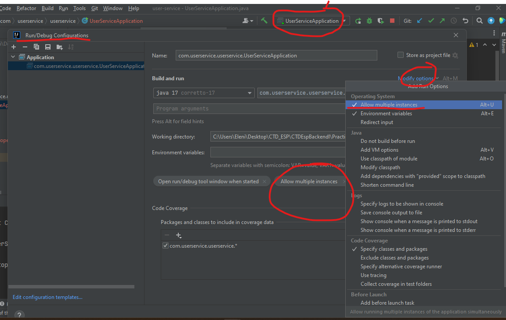
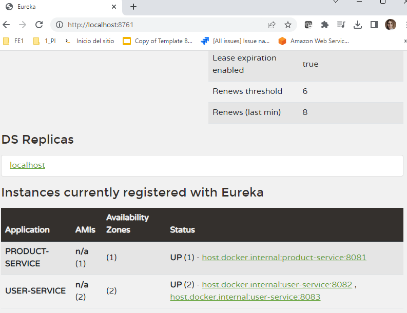

TENER EN CUENTA:

Eureka Server:

en Application.properties:

server.port = 8761  
eureka.client.register-with-eureka = false 
eureka.client.fetch-registry = false 

y en main agregar la anotación: @EnableEurekaServer 

Eureka Client:
cuando configuramos el proyecto hay que agregar en el app. properties:

spring.application.name = user-service  
server.port = 8082  
eureka.client.service-url.defaultZone = http://localhost:8761/eureka/ 

Para poder habilitar múltiples instancias de un micro, primero tengo que cambiar la configuración permitiendo múltiples instancias:

y anrtes de correr la aplicación, tengo que indicar un puerto nuevo para que no genere conflicto:

spring.application.name = user-service  
server.port = 8083  
eureka.client.service-url.defaultZone = http://localhost:8761/eureka/ 

