## Los patrones de diseño son:

<table>
    <thead>
        <tr>
            <th>Patrones de Diseño</th>
            <th>Spring</th>
        </tr>
    </thead>
    <tbody>
        <tr>
            <td>Service Registry</td>
            <td rowspan=2>EUREKA
        <tr>
            <td>Service Discovery</td>
        </tr>
        <tr>
            <td>Edge server</td>
            <td>SPRING CLOUD GATEWAY</td>
        </tr>
        <tr>
            <td>Central configuration</td>
            <td>CONFIG SERVER </td>
        </tr>
        <tr>
            <td>Log aggregation</td>
            <td>LOG4J & ELK </td>
        </tr>
        <tr>
            <td>Distributed tracing</td>
            <td>ZIPKIN & SELUTH </td>
        </tr>
        <tr>
            <td>Circuit Breaker</td>
            <td>RESILIENCE4J</td>
        </tr>
        <tr>
            <td>Reactive microservices</td>
            <td> </td>
        </tr>
        <tr>
            <td>Centralized monitoring and alarms </td>
            <td>DASHBOARD ZIPKIN </td>
        </tr>
    </tbody>
</table>
_____

Uno de los problemas más comunes cuando estamos trabajando con servicios es la necesidad de saber forzosamente dónde se encuentra cada servicio. A medida que las empresas crecen, también lo hace la cantidad de servicios que se requieren para darle soporte a la operación. Esto provoca que cada vez sea más difícil saber en dónde está cada servicio exactamente (IP, puerto).

El patrón **Service registry** permite contar con la creación de un servidor centralizado, donde todos los servicios se registren al momento de iniciar. De esta manera, cada uno de los servicios le tendrá que enviar la dirección IP, el puerto en el que responde al servidor y, finalmente, el identificador de servicio (que por lo general es un nombre alfanumérico que ayuda a identificarlo). De esta forma, el servidor central o registro sabrá exactamente dónde está cada servicio disponible. Veamos cómo funciona

### Service Registry - En Spring: EUREKA
Indispensable en microservicios o en arq desarrolladas nativamente en la nube.
  Permite que los ss se puedan registrar indep de su ubicación física.
1. permite conocer su ubicación fácilmente
2. qué servicios están disponibles

Este patrón propone que sepamos exactamente qué servicios están disponibles y su ruta de acceso. Por lo general, proporciona una interfaz gráfica que nos permite ver todo el universo de servicios que se encuentran activos.

Otra característica es que los servicios que se registren, deberán estar enviando constantemente una señal al registro, conocida como “latidos” (heartbeat en inglés). Esta indica que los servicios siguen disponibles al pasar el tiempo. Si no recibe esa señal, el microservicio lo marca automáticamente como fuera de servicio y puede mandar en ese momento una notificación a algún administrador o DevOps para que lo administre.

Podemos concluir mencionando que el **Service registry** es un componente indispensable en una arquitectura de microservicios porque permite que los servicios se puedan registrar independientemente de su ubicación física. Esto genera que podamos conocer su ubicación fácilmente y, posteriormente, utilizar técnicas de autodescubrimiento para localizarlos y balancear la carga.

_____

### **Service discovery**
El patrón Service registry es complementario al patrón Service discovery (ya veremos por qué), pero antes es necesario aclarar que —en arquitecturas cloud— la elasticidad es la capacidad de la nube para crecer o disminuir en recursos a medida que la demanda aumenta o disminuye. Esto permite que no sea necesaria la intervención humana y que sea posible aprovisionar nuestros servidores o ampliar la capacidad de procesamiento de los existentes a demanda.

Por lo tanto, si la nube es elástica no tiene sentido contar con un archivo de configuración fijo donde se guarden las direcciones de cada servicio porque implicaría tener una persona que continuamente esté actualizando ese archivo por cada vez que una instancia se da de alta o baja.

En la siguiente imagen, podemos apreciar que las nuevas instancias resultan desconocidas para la aplicación, a menos que alguien las agregue manualmente al archivo de configuración. Esto termina siendo algo ineficiente y altamente propenso a errores.

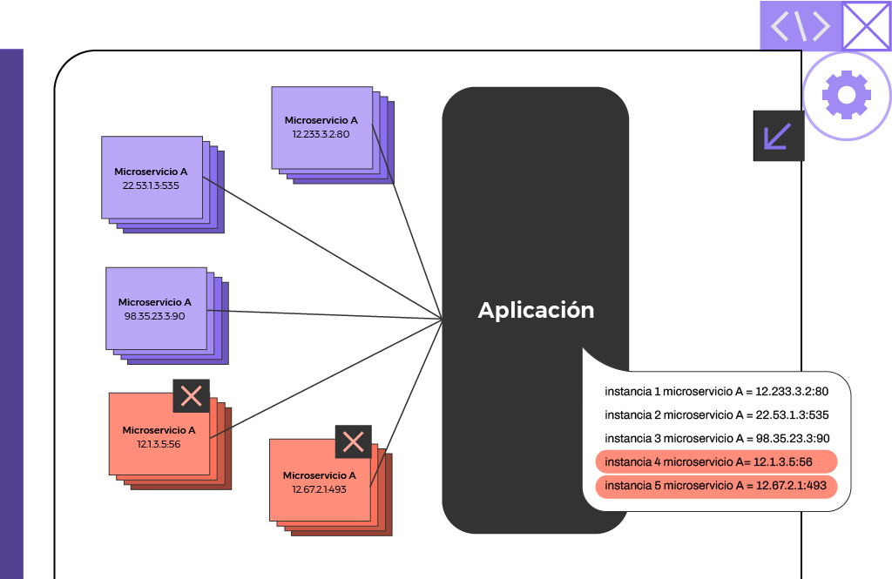

Otra situación la ilustra la siguiente imagen, donde puede verse claramente cómo dos instancias del servicio dejan de responder (o simplemente se han dado de baja), dando por resultado que la aplicación se encuentre desactualizada nuevamente, e incluso termine fallando por intentar ejecutar servicios que no están disponibles.

Es acá donde aparece el llamado Service discovery, encargado de determinar todas las instancias activas de los servicios por medio de un registro central, el cual es nada menos que el Service registry que conocimos anteriormente.

El Service discovery es un componente que se encarga de recuperar del Service registry todas las instancias de los servicios disponibles y realizar el balance de cargas. Sin embargo, existen dos formas en las que este descubrimiento se pueda dar: del lado del cliente y del lado del servidor. Avancemos para conocer la diferencia.

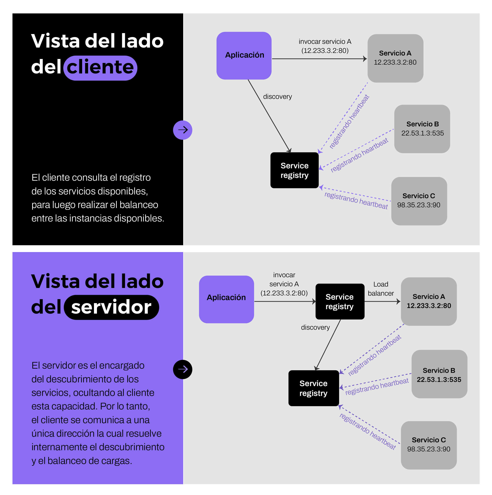

### Service Discovery - En Spring: EUREKA
Permite desacoplarse de los servidores físicos y escalar rápidamente solo con levantar instancias nuevas.
- Recopera del **Service registry** todas las instancias y realizar el BALANCE DE CARGAS.
  - Del lado del cliente
  - Del lado del servidor

___

Es acá donde aparece el llamado Service discovery, encargado de determinar todas las instancias activas de los servicios por medio de un registro central, el cual es nada menos que el Service registry que conocimos anteriormente.

El Service discovery es un componente que se encarga de recuperar del Service registry todas las instancias de los servicios disponibles y realizar el balance de cargas. Sin embargo, existen dos formas en las que este descubrimiento se pueda dar: del lado del cliente y del lado del servidor. Avancemos para conocer la diferencia.

_____
 ## **Edge Server**

 En muchos casos, en una arquitectura de microservicios, es necesario mostrar algunos microservicios fuera del contexto de nuestro sistema y ocultar otros del acceso externo. Aquellos microservicios expuestos al exterior deben estar protegidos ante solicitudes de clientes malintencionados. Es aquí donde juega un rol clave el componente Edge Server, a través del cual pasarán todas las peticiones provenientes del exterior.

 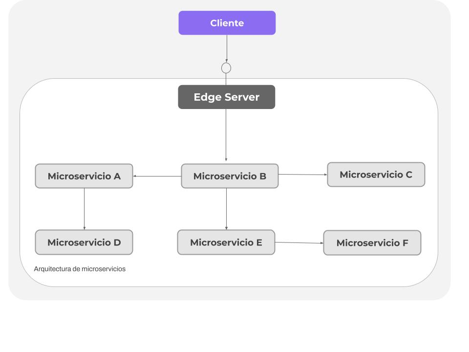

 Típicamente, un componente como este se comporta como si se tratara de un reverse proxy (proxy reverso) y puede ser integrado al Service discovery para ofrecer capacidad de balanceo de carga dinámica.

Por lo tanto, para protegerse de solicitudes maliciosas, podemos hacer uso de protocolos estándares y buenas prácticas —tales como OAuth, OIDC, JWT y API keys—, de manera tal de saber que provienen de clientes confiables. De igual forma, los microservicios que necesiten contar con esta “capa de invisibilidad” pueden hacerse “visibles” para aquellos que requieren su servicio, teniendo configuradas oportunamente las rutas de acceso a los mismos

____

## Central Cofiguration

Normalmente, una aplicación se implementa junto a su configuración, donde podemos encontrarnos con un conjunto de variables de entorno y/o archivos que contienen información de configuración. Ante una arquitectura basada en microservicios, es decir, con una gran cantidad de instancias de microservicios desplegados, surgen los siguientes interrogantes:

. ¿Cómo obtengo una imagen completa de la configuración que existe para todas las instancias de microservicios en ejecución?
. ¿Cómo hacemos para actualizar la configuración y, al mismo tiempo, asegurarnos de que todas las instancias de microservicios afectados adopten la misma?

El patrón propone una respuesta a esto agregando un nuevo componente llamado Configuration server (servidor de configuración) donde almacena la configuración de todos los microservicios, como podemos observar en el siguiente diagrama: 
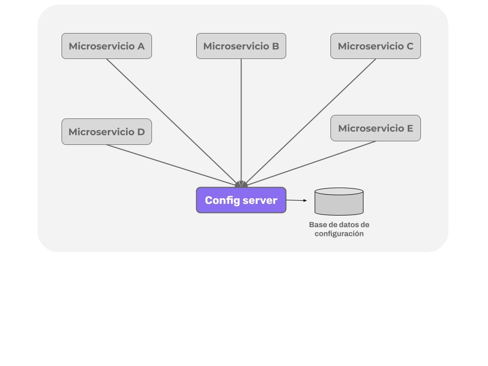

Al mismo tiempo, este permite centralizar toda la información en un solo lugar, incluso con diferentes configuraciones según se trate del entorno (desarrollo, testing, QA, producción, etc.).

___
## Log aggregation

Cuando hablamos de arquitectura distribuida, uno de los problemas más frecuentes es obtener una trazabilidad de la ejecución de un servicio, ya que en este tipo de arquitecturas la ejecución de un servicio pasa por múltiples servicios. Esto dificulta comprender lo que está pasando y contar con un log detallado de lo que está sucediendo. Puntualmente, en el caso de arquitecturas como microservicios, es esperable tener múltiples instancias de un mismo componente, lo que hace aún más tedioso recuperar la traza de ejecución.

Para solucionar este problema, contamos con el patrón Log aggregation, el cual mediante un componente externo nos permite concentrar todos los logs en una sola fuente de datos que podemos consultar más adelante, sin necesidad de tener acceso físico a los servidores y sin importarnos cuántas instancias de cada componente tengamos. De esta manera, mediante este patrón, podemos encontrar los errores de una forma más eficiente, dándole una mejor atención a nuestros clientes.
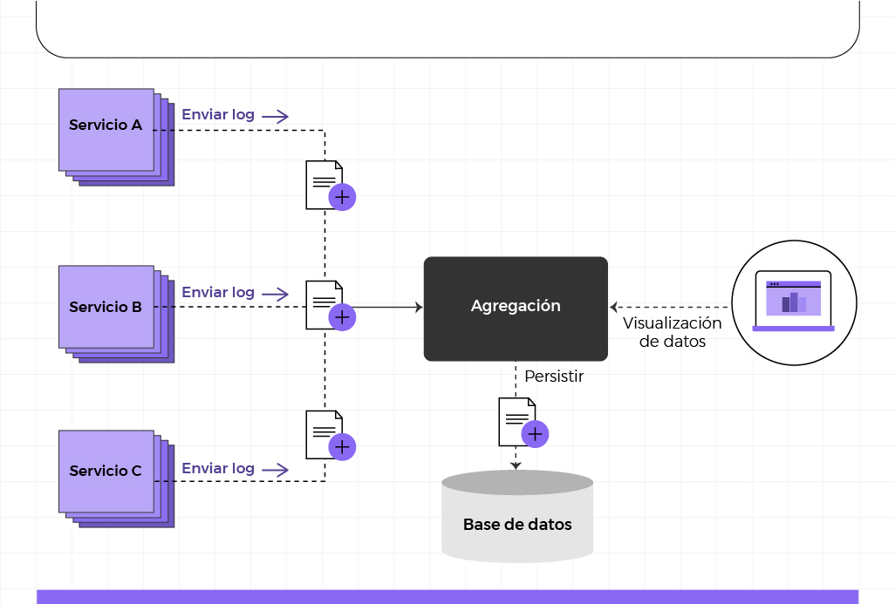

____

## Distributed tracing

Como dijimos anteriormente, uno de los principales problemas en una arquitectura distribuida es la trazabilidad de la ejecución de un proceso porque una sola llamada puede repercutir en la llamada de varios servicios. Esto implica que tengamos que ir recuperando el log por partes, es decir, tenemos que sacar cada parte del log en cada microservicio y luego unirlos, lo cual puede ser una tarea titánica y complicada. Por este motivo, es importante implementar un sistema de traza distribuido que permita unificar los logs en un solo punto y agruparlos por ejecución.

Para poder analizar los retrasos en una serie de llamadas de microservicios que cooperan, debemos poder recopilar marcas de tiempo de cuándo entran y salen solicitudes, respuestas y mensajes de cada microservicio.

Cuando un microservicio se comunica con otro envía en su petición el ID de la transacción global y el de su transacción. Si un microservicio no recibe estos ID, los genera. En el protocolo HTTP estos ID se envían y reciben a través de las cabeceras. Estos permiten correlacionar todas las trazas que emiten los diferentes procesos de los microservicios de una misma petición en la aplicación. Haciendo una búsqueda global por el identificativo global se obtiene el conjunto de trazas que han emitido los microservicios por los que ha transitado una petición.

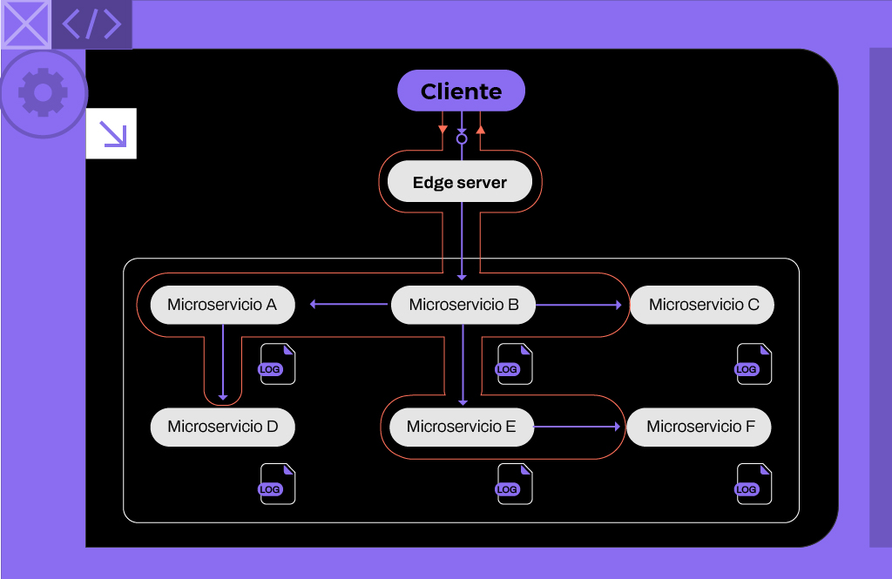

Como conclusión, debemos asegurarnos de que todas las solicitudes y mensajes relacionados estén marcados con un ID de correlación común, y que el ID de correlación sea parte de todos los eventos de registro. En función de un ID de correlación, podemos usar el servicio de registro centralizado para encontrar todos los eventos de registro relacionados.

___

## Circuit Breaker
En la práctica, es habitual que, cuando algo falla, simplemente le mostremos al usuario un error de que algo salió mal y que lo intente más tarde, pero ¿qué sucede si el usuario estaba queriendo hacer una venta? ¿Estamos dispuestos a dejarlo pasar?

Con la llegada de nuevas arquitecturas distribuidas como microservicios, vinieron aparejadas muchas ventajas, pero con ello también aparecieron nuevas problemáticas que pocas veces se saben resolver con precisión. Uno de estos casos es poder identificar cuándo un servicio dejó de funcionar repentinamente para así dejar de esperar peticiones y, al mismo tiempo, hacer algo en consecuencia.

El patrón Circuit Breaker —cortacircuitos o fusible (no confundir con “cortocircuito”, en inglés short circuit)— propone una solución a la problemática anterior y permite trazar una analogía como si se tratara de un fusible (eléctrico) hogareño, el cual se funde para evitar que una descarga eléctrica afecte al circuito. En otras palabras, este patrón permite cortar de manera inteligente la comunicación con un determinado servicio cuando se ha detectado que el mismo está fallando, evitando de esta manera, que el sistema continúe fallando.

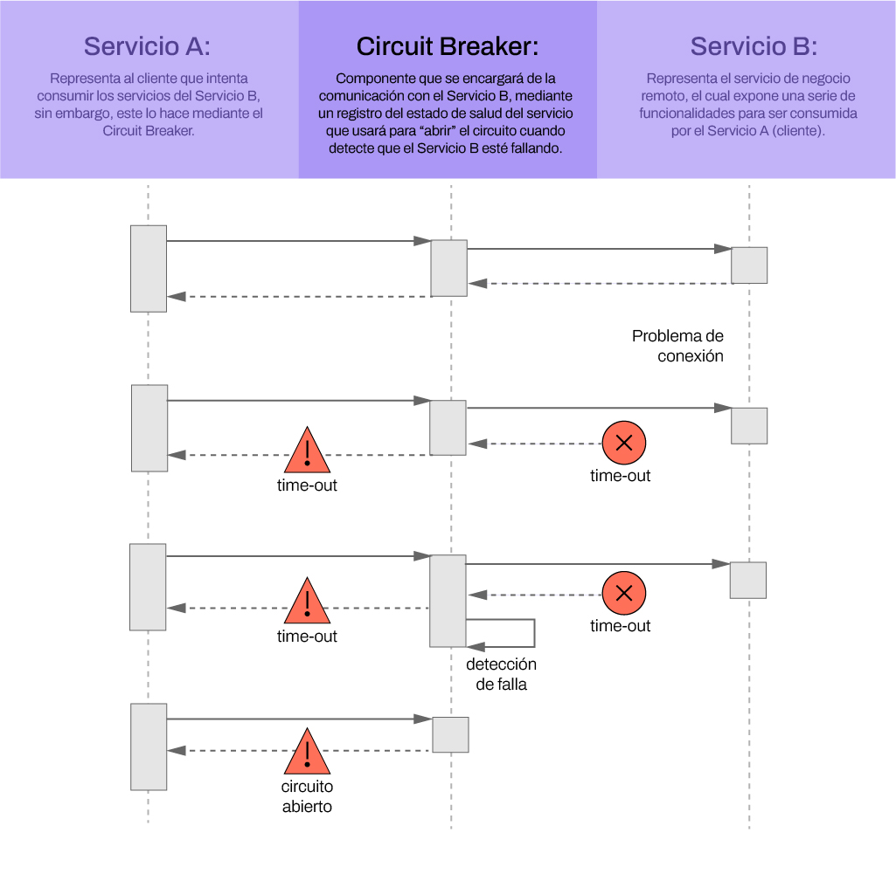

Continuando con el ejemplo, si se tratara de una venta, ante la falla del servicio, podríamos pensar en dejar de mandarle peticiones y ejecutar un plan B en lo que el servicio se reponga. Algunas alternativas podrían ser volver a intentar realizar la venta en diferido, dejando pasar algunos minutos que definamos de manera explícita, o bien enviarlas a una cola para que sea procesada de manera asincrónica y luego sí podamos dar la confirmación de la misma al consumidor final.

Por último, el patrón Circuit Breaker puede pasar por tres estados diferentes. Cada uno de ellos afectará la forma en que funciona. Estos son: **cerrado**, **abierto** y **medio abierto**. Avancemos para conocer más.

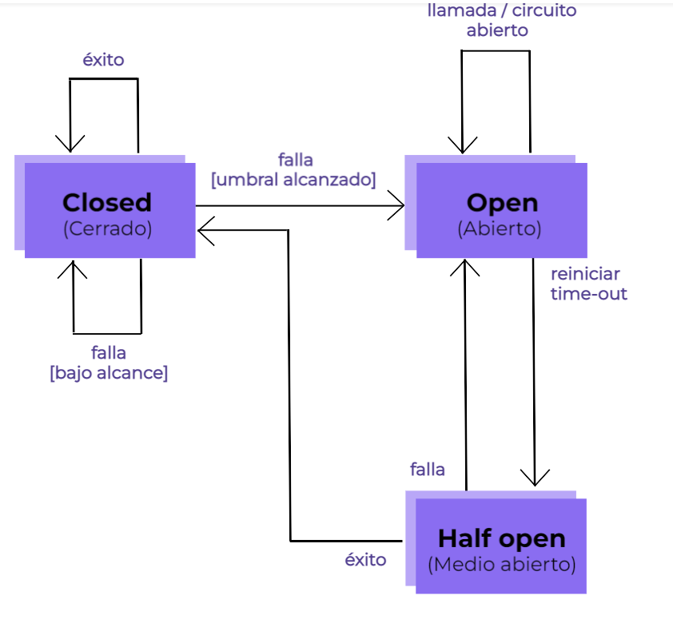

**Closed:** estado inicial que indica si el circuiíto se encuentra respondiendo exitosamente. En caso de alcanzar una cantidad específica de errores (umbral), pasará indefectiblemente al estado OPEN.

**Open:** Si se encontrara en este estado, indica que el servicio destino está fallando, devolviendo un error al invocarlo. Pasado un tiempo en espera, este pasará al estado **HALF OPEN**.

**Half Open:** en este estado podrá recibir una pequeña cantidad de solicitudes para validar si el servicioestá nuevamente activo. Enc aso de que las próximas solicitudes resulten exitosas, el componente pasará a Colsed, caso contrario, volverá a Open.

En líneas generales, el **patrón Circuit Breaker se aplica cuando un servicio depende de otro.** Si otro servicio falla o tarda demasiado en responder (time-out), se vuelve a reintentar un determinado número de veces. Una vez excedido dicho número, se devuelve un error. Caso contrario, se vuelve a la operación normal.

A su vez, este patrón suele delatar problemas de diseño. Supongamos que nuestro servicio depende de un servicio de terceros que falla continuamente. Una opción es llamar al owner y pedir que lo “arreglen”, pero a veces esto no es posible. Entonces, la solución —en vez de una llamada al servicio directa— debería ser el uso de una cola de mensajes y hacer que la operación sea asincrónica.

|A modo de conclusión, el patrón Circuit Breaker es muy utilizado en procesos críticos, evitando de antemano que nuestra aplicación se vea envuelta en una gran cantidad de peticiones que sabemos que van a fallar, consiguiendo tomar una acción en consecuencia. Siempre se deberá priorizar dar respuesta del servicio, así sea de una forma diferente|
|--|

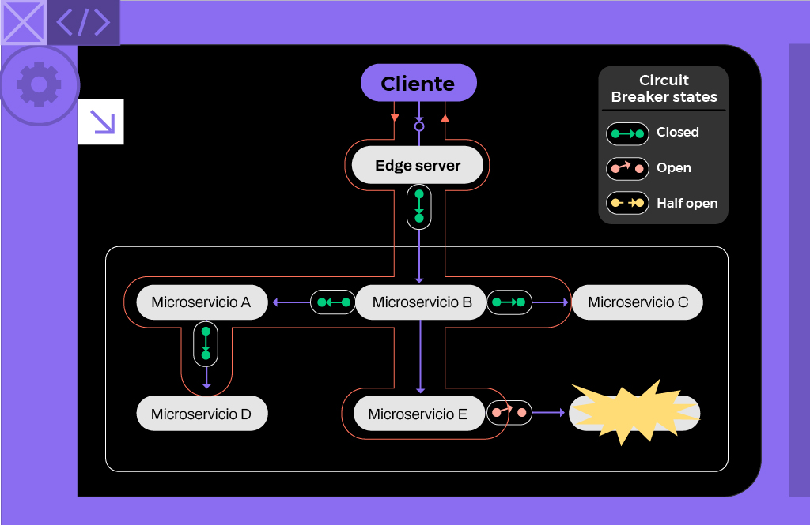

___

## Reactive microservices

Como desarrolladores, estamos acostumbrados a implementar la comunicación sincrónica mediante bloqueos I/O (bloqueos de entrada/salida), por ejemplo, para el caso de una API RESTful JSON sobre HTTP. El servidor que recibe alguna petición y, conforme a esta, espera dar una respuesta asigna (dentro del sistema operativo) un subproceso durante el tiempo que tome la solicitud. Ante este escenario, si aumenta la cantidad de solicitudes simultáneas, dicho servidor podría quedarse sin subprocesos disponibles. Esto puede provocar diversos problemas, que van desde tiempos de respuesta más prolongados hasta fallas en los servidores. En una arquitectura de microservicios, este problema suele empeorar aún más, ya que usualmente se involucra a una serie de microservicios cooperativos para atender una solicitud. Y cuantos más microservicios participen en la atención de una solicitud, más rápido se agotarán los subprocesos disponibles.

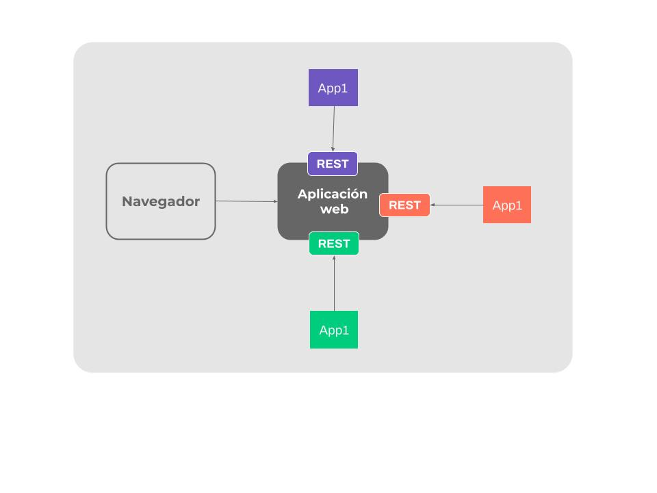

Por lo tanto, lo que ofrece este patrón es hacer uso de llamadas asíncronas no bloqueantes siempre que sea posible. Esto incluye las llamadas habituales a recursos muy lentos a través de la red, las llamadas a base de datos, la gestión de peticiones y —en general— todo el flujo de llamadas. De esta manera, necesitaremos utilizar programación reactiva para realizar una comunicación asíncrona óptima y correcta entre los distintos API REST de los diferentes microservicios que creamos.

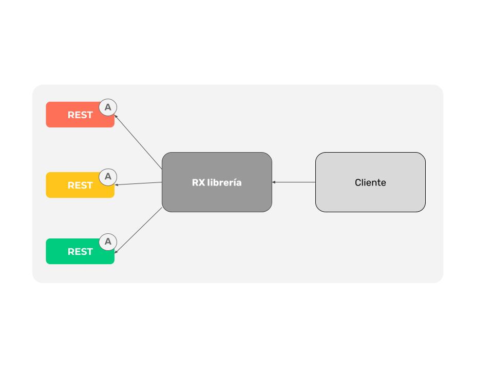

Los sistemas creados como sistemas reactivos son más flexibles, poco acoplados y escalables. Esto los hace más fáciles de desarrollar y susceptibles de cambiar. Son significativamente más tolerantes ante fallos y, cuando ocurre uno, lo enfrentan con una solución pragmática en lugar de resultar un desastre.

Pensemos un **ejemplo de un microservicio bloqueante y no bloqueante**

Supongamos que tenemos un e-commerce con un proceso de checkout de una orden que consiste en comprobar las ofertas, comprobar el stock y comprobar el envío. Cada paso toma 1 segundo (con el servidor desocupado) y el servidor tiene capacidad para mantener 10.000 sesiones abiertas en simultáneo.

Si nuestra operación es sincrónica bloqueante, el usuario va a enviar su petición y, a los tres segundos, se ejecutarán todos los pasos. En esos tres segundos se verificará todo, pero ¿qué pasa si suceden 10.000 órdenes simultáneas? Se ejecuta correctamente la primera, la segunda tarda un poco más (porque tiene que esperar que termine la anterior) y, cuando llegamos a 5.000, el sistema se degrada y comienzan a aparecer los errores al saturarse el servidor.

Ahora, supongamos que nuestra operación es asincrónica. El servidor recibe el checkout del usuario y envía el evento a una cola de mensajes para que los servicios de ofertas, stock y entrega vayan levantando las órdenes. El usuario recibe el mensaje “su orden está siendo procesada” en una milésima de segundo y se libera el servidor. Entonces, si tenemos 10.000 órdenes y vienen 10.000 más al siguiente segundo, el sistema no se degrada. Quizás algunas órdenes “en proceso” no se cumplirán por falta de stock, pero en la práctica este caso es mucho mejor porque:

No se bloquea el servidor y seguimos recibiendo órdenes.
La ventana de stock desactualizada es muy pequeña.
Los proveedores tienen un margen de stock de seguridad.
Podemos paralelizar procesos.
Si quieren saber más al respecto, en el año 2013 se definieron los principios claves para el diseño de sistemas reactivos en un documento que llamaron “The Reactive Manifesto” (El manifiesto reactivo). Pueden leerlo en el siguiente link: https://www.reactivemanifesto.org

___

## Centralized monitoring and alarms

Si los tiempos de respuesta observados y/o el uso de recursos de hardware se vuelven inaceptablemente altos, puede ser muy difícil descubrir la causa del problema. Necesitamos poder analizar el consumo de los recursos de hardware por microservicio. Para eso, podemos agregar un nuevo componente: Monitor service (un servicio de monitoreo), que es capaz de recopilar métricas sobre el uso de recursos de hardware para cada nivel de instancia del microservicio. Este nos permitirá:

Recopilar métricas de todos los servidores que utiliza el entorno del sistema, incluyendo servidores de escalado automático.
Detectar nuevas instancias de microservicios a medida que se lanzan en los servidores disponibles y comenzar a recopilar métricas de ellos.
Proporcionar una API y herramientas gráficas para consultar y analizar las métricas recopiladas.
Definir alertas que se activan cuando una métrica determinada excede un valor de umbral específico.

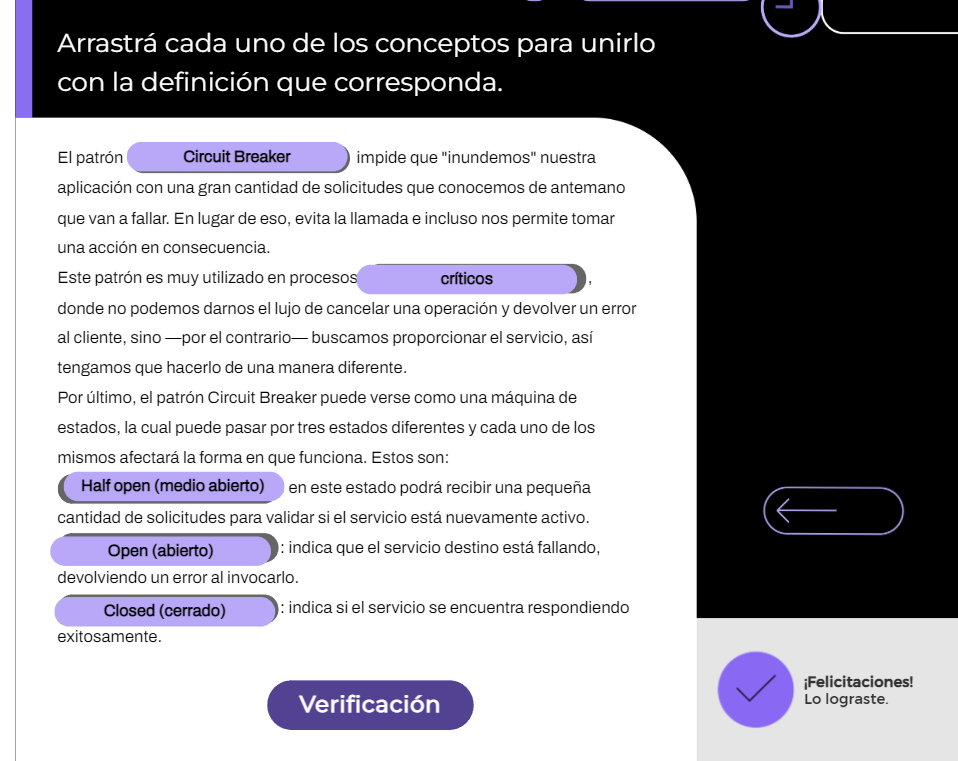

