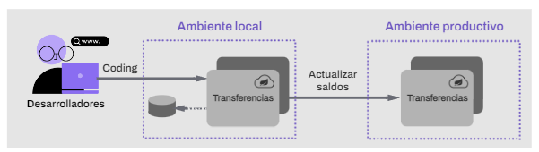
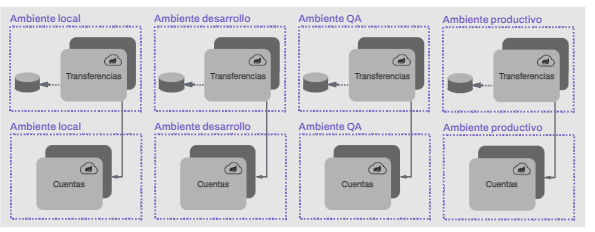
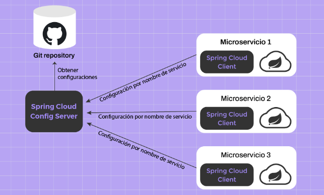
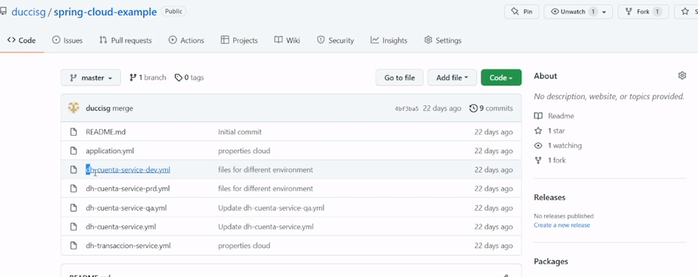
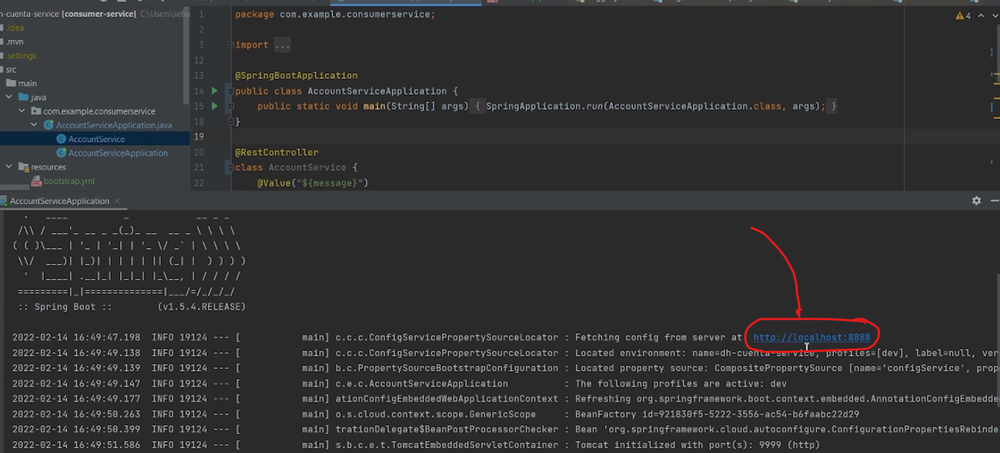

## Introducción a la problemática de las configuraciones

Pensemos en una organización que comienza a crecer en términos de escala, por ende, comienza a desarrollar microservicios atómicos que dan soporte a los distintos procesos de negocio. Estos microservicios que proveen la infraestructura, el procesamiento y el soporte de datos necesitan de diferentes tipos de configuraciones para funcionar, por ejemplo:

Localización de otros microservicios.
- **Paths** de base de datos y endpoints de los servicios que se desplegarán.
- **Dirección IP** de servidores de almacenamiento, tales como FTP o S3.
- **Tipo de logging** de información por Log4j (INFO, ERROR, DEBUG).
- **Contraseñas y/o secretos** (en la práctica se aplica seguridad adicional en este caso).
Variables de entorno.

Pero… ¿Por qué esta información necesita una configuración en particular y no puede estar como constantes dentro de una aplicación? Veamos cuáles son las razones: 
1) DESACOPLAR LA INFORMACIÓN DE LA CONFIGURACIÓN DEL GÓDIGO: Un desarrollador no tiene por qué conocer la URL de la base de datos de producción, ni las contraseñas, ni otras configuraciones generales que suelen ser manejadas por infraestructura o por DevOps. Imaginemos que el equipo de infraestructura tiene que cambiar una URL interna, no tendría sentido pedirle a cada equipo de desarrollo que redeploye, ya que los sistemas deben ser capaces de reaccionar a tales cambios de configuración.

2) SEPARACIÓN DE AMBIENTES (desarrollo, QA, producción) Cada ambiente va a manejar su propia configuración. Si bien esto se puede manejar con archivos (y en la práctica, y hasta cierto nivel, esto es así), para determinadas configuraciones (múltiples instancias) y determinado número de microservicios, es necesario centralizar las configuraciones.
3) EVITAR DEPLOYS POR CAMBIOS DE CONFIGURACIÒN Supongamos un escenario en el cual varias configuraciones están embebidas en el código. Hay configuraciones que se mantienen por años, otras por meses y otras por semanas. La diferencia entre tener la configuración embebida en el código o separada es que el segundo no necesita deploys, solo restarts. Si un proceso de deploy completo demora 6 minutos por instancia y un restart demora 2 minutos, la ventaja es obvia.

Ejemplo:
Supongamos un escenario en el cual varias configuraciones están embebidas en el código. Hay configuraciones que se mantienen por años, otras por meses y otras por semanas. La diferencia entre tener la configuración embebida en el código o separada es que el segundo no necesita deploys, solo restarts. Si un proceso de deploy completo demora 6 minutos por instancia y un restart demora 2 minutos, la ventaja es obvia.

Necesitamos tener un servicio estable de cuentas que garantice que la operación se realice para luego verificar por una prueba que los saldos han sido actualizados. Si tenemos únicamente el microservicio en un ambiente real, terminaríamos impactando cuentas finales de usuarios, lo cual es un grave error.
Es obligatorio tener varios ambientes de trabajo, donde tengamos toda la infraestructura, servicios, base de datos y recursos necesarios para garantizar la
operatividad de nuestro sistema de forma correcta e integral. Es decir, si muevo $100
de una cuenta A a una cuenta B, al final de la operación, la cuenta B debe tener más $100
y la cuenta A, -$100. Podríamos representar esta necesidad de la siguiente manera:

Analizando el diagrama vemos que nuestro microservicio de transferencias accede a un microservicio de cuentas diferente —según el ambiente donde se encuentre—, y esta capacidad no debe estar como constante especificada a nivel código, ya que es variable según el ambiente y también puede sufrir cambios en el mismo ambiente, al cambiarse —por ejemplo— la URL final. 

| Si esta configuración estuviese programada y no configurada de forma externa, deberíamos recompilar el proyecto desde cero por cada deploy en cada ambiente, lo cual decrementa abruptamente el TTM visto en la primera clase.|
|---|

## Solución a las configuraciones distribuidas con Spring Cloud Config
La solución de Spring Cloud nos provee de un framework llamado Spring Cloud Config que nos facilita el trabajo de configuraciones de microservicios y ambientes mencionado anteriormente. Para esto, nos brinda dos componentes básicos: **Spring Cloud Config Server** y **Spring Cloud Client**. Estos interactúan entre sí para lograr su cometido, como vemos en el siguiente diagrama:

### Conclusión
Spring Cloud Config aporta una excelente solución a las configuraciones que necesitamos hacer en sistemas que están distribuidos, realizando estas configuraciones de manera externa al propio microservicio y de manera centralizada para todos los microservicios.

__________

### Notas live coding
Chequeo q el server tenga:
1) la dependencia **Spring cloud config server**: habilita al microservicio como servidor de aplicaciones
2) También  @EnableConfigServer
3) tengo q especificarle al microservicio de dónde tiene que sacar las configuraciones. Para eso, dentro de la carpeta **Resources** del micro
tengo que tener un archivo yml con el puerto del microservicio y así mismo, defino la URL de git donde van a estar las configs de los microservicios que van a consumir esto.

-.-.-.-.-.-.-.yml-.-.-.-.-.-.-.
server:
    port: ${PORT:8888}

spring:
    application:
        name: config-server (o como se llame mi servidor)
    cloud:
        config:
            server:
                git:
                    uri: acá va la url del repo público q creo para los ymls de los microservicios por ejemplo:

                   **https://localhost:8088/dh-cuernta-service/dev**

-.-.-.-.-.-.-.yml-.-.-.-.-.-.-.

Podemos ver que cada ambiente tiene un archivo en particular porque  cada ambiente va a disponibilizar ambientes en distintos puertos y pueden tener diferente configuración.

Para que un microservicio pueda utilizar usar como cliente spring cloud server tenemos que asegurarnos de:
1) dependencia spring-cloud-starter-config
2) archivo denominado bootstrap.yml

-.-.-.-.-.-.-.yml-.-.-.-.-.-.-.
spring:
    application:
        name: dh-cuenta-service (o como se llame a mi microservicio en Git)
    cloud:
        config:
             uri: ${CONFIG_SERVER:http://localhost:8888}
    profiles:
        active: dev (acá indico cuál es el perfil activo)

-.-.-.-.-.-.-.yml-.-.-.-.-.-.-.

si inicializo la aplicación va en el puerto 9999 pero va a tomar la configuración del puerto 8888 del servidor que definí:

(notar que el .yml está metido en el proyecto, pero el proyecto no está en ése repo)
