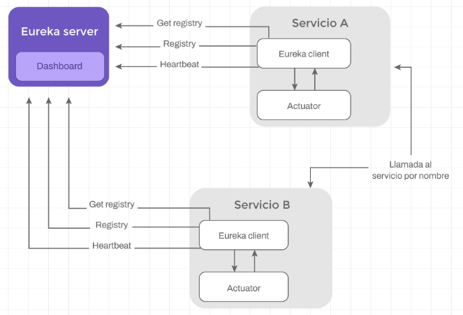

## SPRING CLOUD NETFLIX (2018)

Frameworks y librerías para resolver problemas de sistemas distribuidos a gran escala como:
- descubrimiento de servicios
- balanceo de cargas
- tolerancia a fallos
- ruteo
- configuración

Eureka es un servicio REST que registra y localiza microservicios existentes, informar de su localización, estado y datos relevantes de cada uno.

Durante su arranque, cada microservicio se comunicará con el servidor  EUREKA para notificar si está disponible, su ubicación y metadatos de esta forma, Eureka mantendrá en su registro la info de todos los micros del sistema.
Los micros informan su estado cada 30'' en lo que se denomina **HEARTBEAT**. Si después de 3 períodos (90'') Eureka no recibe notificación, se elimina del registro. Del mismo modo, si recibe 3 notificaciones seguidas, considerará al servicio disponible de nuevo.

Además, EUREKA permite aumentar o disminuir las instancias de nuestro microservicio de manera dinámica y transparente para el resto de los microservicios.

Es decir, si tenemos 2 microservicios, A y B, y A consume un endpoint que expone la Api de B, ubicada en una URL formada por una dirección y un puerto. ¿Qué pasa si deployamos una nueva instancia de B o eliminamos la instancia actual y creamos otra?, tendríamos que buscar en el código y modificar la URL. Gracias a EUREKA podemos ubicar los servicios usando el nombre x el que se registrarion y no su IP (x en https://servicio-b). En este sentido es transparente, porque una nueva instancia de B será registrada por EUREKA con el mismo nombre.

Además, podemos integrar EUREKA con un **LOAD BALANCER** que permitirá enviar la petición al servidor que mejor prepardo esté para ejecutarla es decir, al microservicio A le es indiferente cuántas instancias de, micro B haya y su ubicación, ya que siempre se comunicará de la misma manera. 

¿Cómo funciona Eureka?

Hay dos grandes componentes
- EUREKA Server
- EUREKA Client

por un lado, vamos a tener un servicio donde se va a ejecutar EUREKA SERVER y por otro, cada microservicio de nuestro ecosistema deberá configurarse como un cliente de EUREKA, de esta manera, todos los cientes tendrán comunicación con el servidor de Eureka.

En conclusión, más allá de la tencología, tener un service registry, nos permite abstraernos de la ubicación física del microservicio y abstraernos y conocer el estado del ecosistema de microservicios, aumentando la tolerancia a fallos y permitiéndonos escalar dinámicamente.

## Registro y descubrimiento de microservicios: ¿Qué problemas viene a solucionar?

El estilo de arquitectura de microservicios no se trata tanto de construir servicios individuales, sino de cómo hacer que las interacciones entre los servicios sean confiables y tolerantes a fallas.

En una arquitectura de este tipo, cada microservicio se encuentra en una dirección IP y un puerto, generalmente asignados dinámicamente. Esto dificulta que un cliente realice una solicitud a un microservicio que, por ejemplo, expone una API REST a través de HTTP.

Consideremos el siguiente diagrama. Tenemos un servicio con tres instancias, en la que cada una de ellas se encuentra en una ubicación diferente. ¿Cómo podría saber el cliente la dirección de cada uno de ellos?, y si vamos un paso más allá de la dirección, ¿cómo podría saber cuál es la instancia con menos carga para procesar la petición enviada?

Ante este problema, debemos agregar un nuevo componente a nuestra arquitectura que nos permita:

- Registrar automáticamente los microservicios y sus instancias, tan pronto como se encuentren ejecutando y eliminarlas del registro en cuanto dejan de ejecutarse o dejan de responder.
- El cliente debe ser capaz de enviar una solicitud a los microservicios sin conocer su ubicación.
- Las solicitudes a las instancias de un microservicio deben poder ser equilibradas mediante un balanceador de carga.

**En Spring Cloud este componente es Eureka**

### Arquitectura Eureka server

Podemos dividir Eureka en dos grandes componentes: 
- **Eureka client**, el encargado de publicar la información del microservicio en el que se encuentra; 
- **Eureka server**, el encargado de recopilar la información de todos los clientes.

## Monitoreando la salud de nuestros microservicios con Spring Boot Actuator (heartbeat)

En un ecosistema de microservicios e instancias es necesario llevar un control de los mismos, ya sea por errores, para balanceo de carga o incluso para analizar métricas para determinar si necesitan más instancias de un servicio en particular.

Puede haber varios escenarios de problemas en una instancia, pero los más comunes son errores por excepción de aplicación, timeout y errores de instancia. Los errores de aplicaciones son las excepciones programadas. Los de instancia puede ser, por ejemplo, que la instancia se quede sin espacio en disco o sin memoria. Mientras que los errores de timeout suceden cuando la respuesta llega después de un determinado umbral.

Obviamente, no se puede monitorear cada endpoint y mandar datos “inertes” cada vez. En la práctica se utilizan endpoints especiales que devuelven información crítica respecto del estado de la instancia y el servicio.

La solución que ofrece el framework de Spring para este problema es Spring Actuator, que básicamente genera los endpoints necesarios para este monitoreo de manera automática. A su vez, las respuestas de estos endpoints pueden ser “sondeadas” por balanceadores de carga u otras aplicaciones para administrar el tráfico, tales como Eureka.

Spring Boot Actuator ofrece funcionalidades listas para un entorno de producción que supervisan nuestra aplicación, recopilan métricas, comprenden y analizan el tráfico y el estado de nuestra base de datos. Todo esto sin necesidad de tener que implementarlo por nuestra cuenta.

Los Actuators se utilizan principalmente para exponer información operacional sobre nuestra aplicación en ejecución (health, metrics, info, dump, env, etc.) a través de una API REST.

### Endpoints útiles
|endpoint|explicación|
|----|----|
|/health|Muestra información acerca de la salud de nuestra aplicación. Un simple “estado” si estamos sin autenticar, o información mucho más detallada si estamos autenticados en la aplicación.|
|/info	|Muestra información arbitraria de nuestra aplicación.
/metrics	|Muestra la información de métricas de nuestra aplicación.|
|/trace	|Muestra información de seguimiento (por defecto las últimas peticiones HTTP).|
|/serviceregistry|	Muestra el estado del registro en Eureka server.|

Por defecto, solo el endpoint **/health** está habilitado para consumirlo, para habilitar el resto tenemos que configurar la siguiente propiedad en application.properties:

management.endpoints.web.exposure.include=serviceregistry,health,info

Por ejemplo, con esta configuración estamos habilitando los endpoints **/serviceregistry, /health e /info**. En caso de querer **habilitar todos**, ingresamos:

management.endpoints.web.exposure.include=* 

Si querés conocer más sobre los endpoints que ofrece Actuator, te recomendamos ingresar en el siguiente [link](https://docs.spring.io/spring-boot/docs/current/reference/html/actuator.html#actuator.endpoints.exposing).

Por otro lado, Eureka server utiliza los endpoints **/health e /info** para obtener información sobre los microservicios. 

Por defecto, si realizamos una solicitud HTTP mediante el método GET al endpoint **/health** nos responderá:

{

"status" : "UP"

}

En el caso de **/info**, podemos personalizar la respuesta configurando ciertas propiedades, por ejemplo:

info.app.name=mi-servicio 
info.app.description=Servicio probando Eureka 
info.app.version=1.0.0

 
La respuesta será:
 

{ 
"app" : { 
"version" : "1.0.0", 
"description" : "Servicio probando Eureka", 
"name" : "mi-servicio" 
} 
} 
