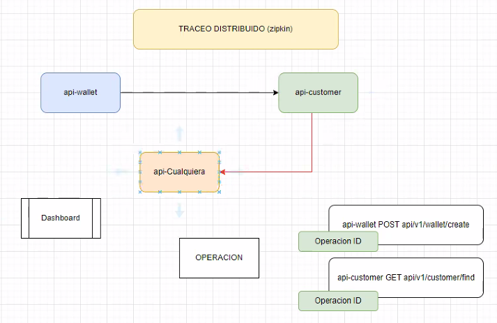
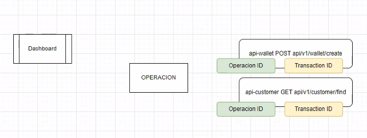
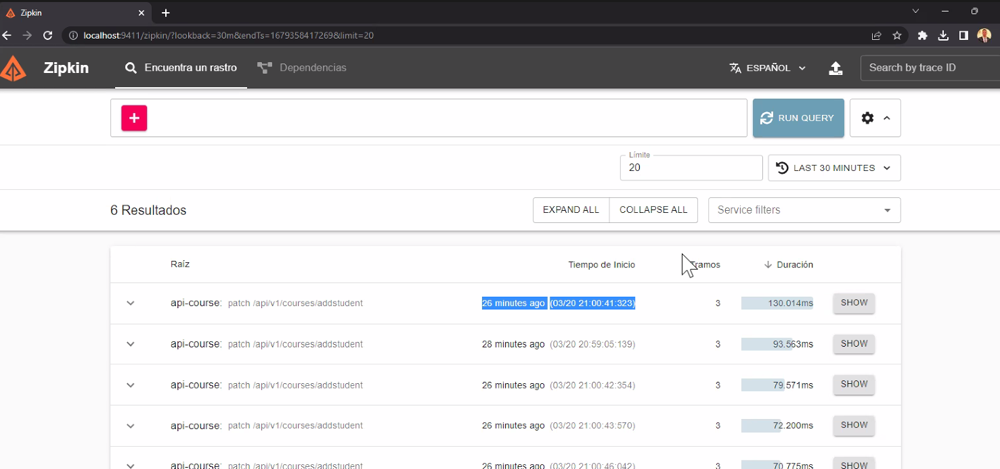
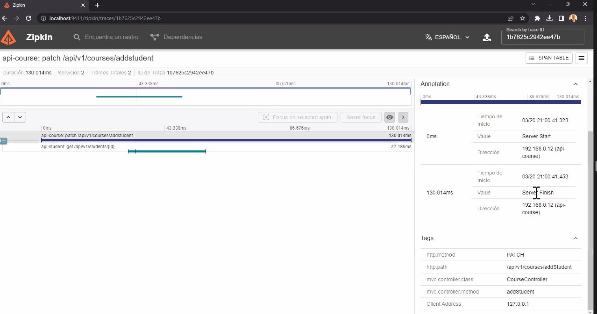
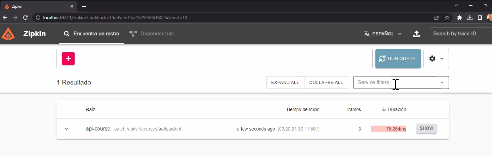
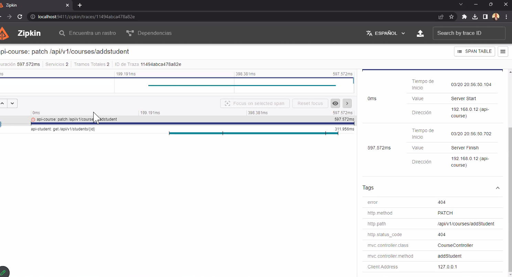
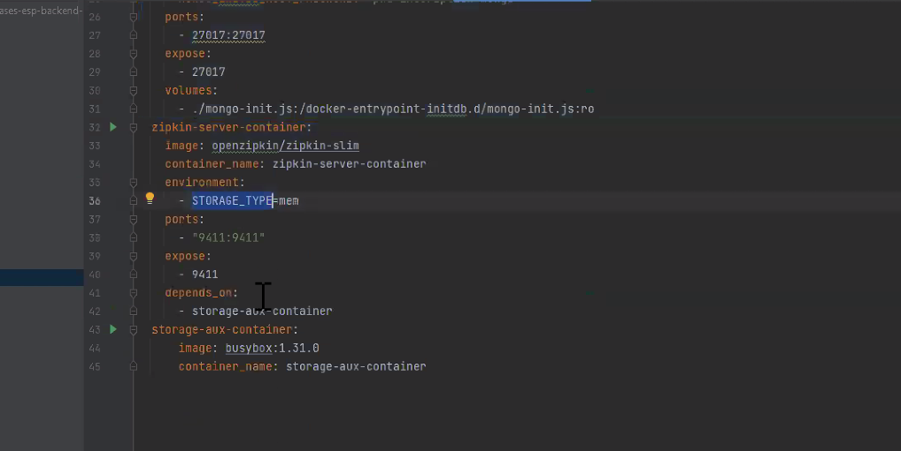

Librería ZIPKIN ofrece dashboards y tiene la particularidad de que empieza a agregar en las peticiones

OPERACIÓN: está compuesta por dos pasos el post que desencadena el flujo y el get que es secundario. Si quiero hacer la tazabilidad de la operación, debería ponerle un identificador como operaciónId que va a implementarse en el header y desde que arranca la operación se genera el ID que se va a forwardear a todos los endpoints, para que cuando haga la query me traiga todsas las interconexiones ("me dibuje el paso a paso")

Me hace el dibujito y me va a mostrar más fácil donde estaá el error.

Los request además tienen un ID de transacción que los identificad de forma única, pero varias transacciones pertenecen a una misma operaciónID. Voy a detectar cuál es el componente que está fallando.

Una herramienta gráfica tiene la facilidad de mostrar de manera muy explícita dónde está el error o en qué conexión de mis aplicaciones por ejemplo, me la mandé =)

IMPLEMENTACIÓN
1. Primero necesito implementar un servidor de Zipkin
   1. x docker
2. El servidor va a concentrar todos los traceos, va a informar todas las operaciones y transacciones (esto lo hace la librería internamente) o le pega a los endpoints o lo pone como un mensaje en una cola y el dashboard lo va levantando

La librería tiene dos soluciones para que no se sature. Si el dashboard se me cae x un microcorte, perdí un log. Si es algo controlado, me banco la solicitud http online, pero si tengo una transaccionalidad en el micro muy elevaea y quiero hacer un logueo de todas las operaciones, llega un momento en el que puede saturar, entonces, dejándolo en una cola, el server de zipkin lo levanta cuando puede. --> comunicación asincrónica con cola de mensajes

se puede buscar por transaction ID y eso se obtiene porque la idea es que si tenés un error, le digas al handler que tire el número de transacción para que después sea más fácil buscarlo

Si tengo un error:

CONFIGURACIÓN:
(si le agrego la librería en gateway y eureka)
- en los microservicios: agregar 2 liberrías
  - una sleuth
  - dos sleuth con zipkin

- en los archivos de configuración:
  - configurar url de zipkin y 
    - si fuese x http solo url
    - si fuese con rabbit es distinto
  
Si estamos usando docker: 
- ahí mandamos
- le puedo decir q almacene en memoria o base de datos

- environment es si necesita variable de entorno, el puerto es importante, uno levanta y el otro es en el que quiero exponer para afuera
- 