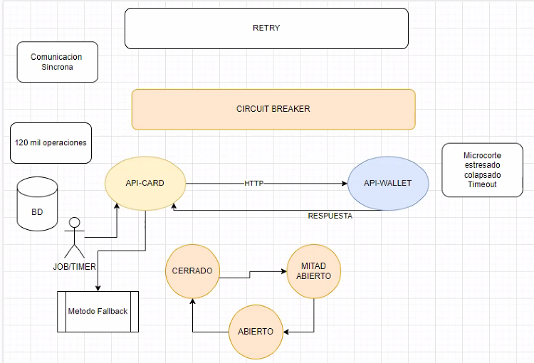
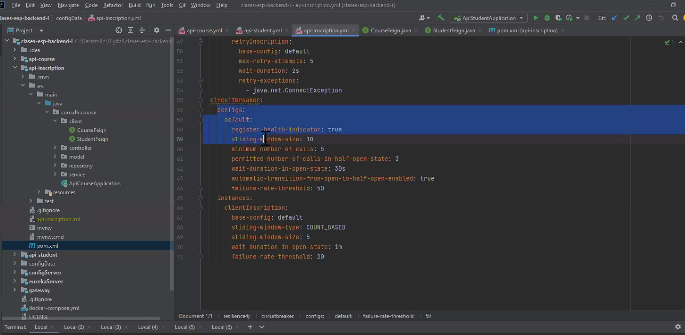
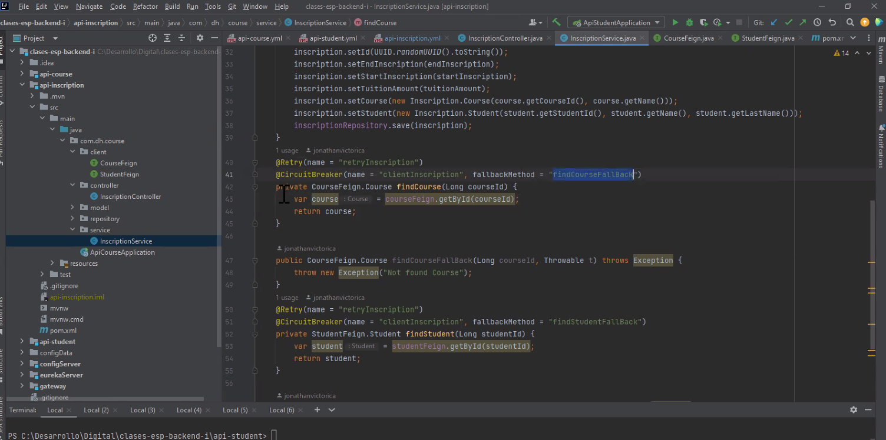
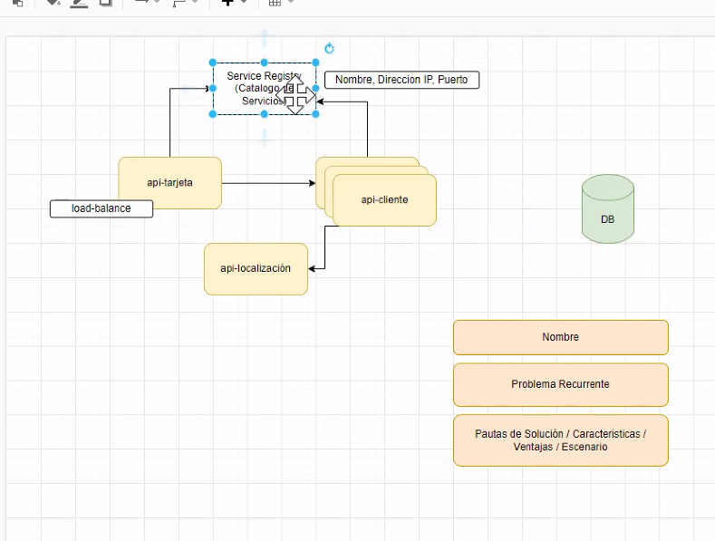

si el circuíto está abierto, no me va a permitir pegarle más a api-margins

La librería ofrece un método tipo try/catch que permite de alguna manera tener un plan B, o notificación al usuario o algún otro método.

Cómo se dá cuenta que api márgenes va a levantar en algún momento (x ej se cayó x 2')
api card sigue recibiendo solicitudes
Cómo hace el cirquit breaker para otra vez cerrar el circuito?

Va pasando a un estado semi-abierto, si llegan variaws solicitudes, una la frena y otra la deja pasar y vé qué onda. Si yo dps de haberme caído le pego 3 veces y "anda" entonces vuelvo a cerrar el circuito.

Si en vez de api-margins tengo api-wallet, y estamos a fin de mes y tengo 120.000 operaciones, lo que va a hacer card: gasté 200000 y la manda a wallet para pagar la tarjeta tipo proceso automático que lo ejecuta un timer y empieza a correr un proceso (tipo un job). Qué pasa si necesito asegurar que las 20.000 operaciones se ejecuten (pensando que todo tiene saldo y todo bonito), es un proceso q api-card le va a demandar a wallet.

La librería de cirquit break ofrece un método de FALLBACK.

Si wallet empieza a dar error, cae en el método del fallback, y le pedimos que "espere". Para implementar esto, teniendo en cuenta que las operaciones se guardan en una base de datos, cómo haríamos para que no se pierdan?
1) una cola de mensajes, pongo ahí las operaciones, y cuando se restartee todo, agarro las operaciones en el orden q llegaron y reinicio.
2) marco en el select en la base de datos. Agrego un campo estado en las operaciones: procesado, no procesado y con prioridad y entonces levanto cuando todo vuelve, la que dice con prioridad y luego los no procesados.

## si hay un error que sea tolerante al error

que no vuelva a invocar en el fallback a api-wallet, ya no lo puedo invocar, o dejo la operación dormida en la base de datos (NO EN MEMORIA) para que cuando vuelva a la normalidad, siga procesando. 

El fallback es como el try-catch, es un plan B para varias cosas.

## RETRY

El Retry sirve para que haga los intentos x detrás. Si tuviera un microcorte y cancelo una operación crítia ME MUERO! Entonces el retry, lo que hace es ok me falló, entonces pasados 3'' vuelvo a probar.

Una cosa es reintentar cuando el circuito está cerrado, pero cuando el circuito se abrió ya está no va más.

En el circuit break voy a configurar cuántas llamadas tienen q dar error para que cierre el circuíto. una bien, una mal una bien una mal cierro ponele. Configuro cuántas veces quiero que reintente y cuánto tiempo quiero q espere (internamente queda en memoria).

-------7

Hay otro patrón de la familia de esta librería

(hay como 7 patrones de esta familia) otro es el **RATE LIMIT**:  el rate limit si a un microsist le pego le pego y la hago caer (ponele un postman con pruebas de stress). Lo que hace este patrón es ponerte un freno a cuántas solicitudes pueden venir en un lapso de tiempo (desde una misma IP/ cliente o a nivel general de la operación (venga de donde venga, no sería lo mejor porque tendría que solucionarlo x escalamiento))

-------

En código:

La librería se puede configurar muchísimo. Se puede hacer en appication.yml, por objeto y por anotaciones

lo bueno es que si va en yml lo desacoplo:

Si hay muchas configuraciones que se van a repetir, las agrupo en algo por ej, llamado default... default1... como quiera, pero todo junto.

En playground dice cada elemento. los más importantes:
-  tiempo de duración abierto
-  llamadas para pasar de une stado a otro
-  que la transición entre estados sea automático (siempre conviene q sea así)
-  nro de llamadas que voy a permitir cuando esté en abierto o semi para verificar q levantó

en Instances, digo que la base del config, va a sert todo lo q tengo en default, y dps pongo las específicaws, si pongo el mismo atributo que uno de los que tengo arriba, sobreescribo.
- sliding-window-type: cómo hago que pase de un estado a ottro o basado x cantidad de operaciones o basado en tiempo COUNT_BASE TIME_BASE (en segundos) y el sliding-window-size son las unidades o segundos o cantidad.
- treshold es cuánto voy a tolerar, 20 es 20% es un **rate** un porcentaje el 20% de 5 si pusiera 5 operaciones.

tengo que envolver toda la clase en el @circuitBeaker y @Retry

Para configurar el Retry, es más fácil es para microcortes, son menos 

le pongo qué frente a qué excepciones tiene que saltar. Lo que veo en este ejemmplo es que piso todo el default, pero es a modo de ejemplo, puedo siempre definir un defaul y si tengo varios (microservicios/instancias ?), ahí pongo cada uno.
Son 3 properties. 
La idea de las instancias es que puedo hace más de 1 tipo de configuración distinta.

@Retry(name="retryInscription")
