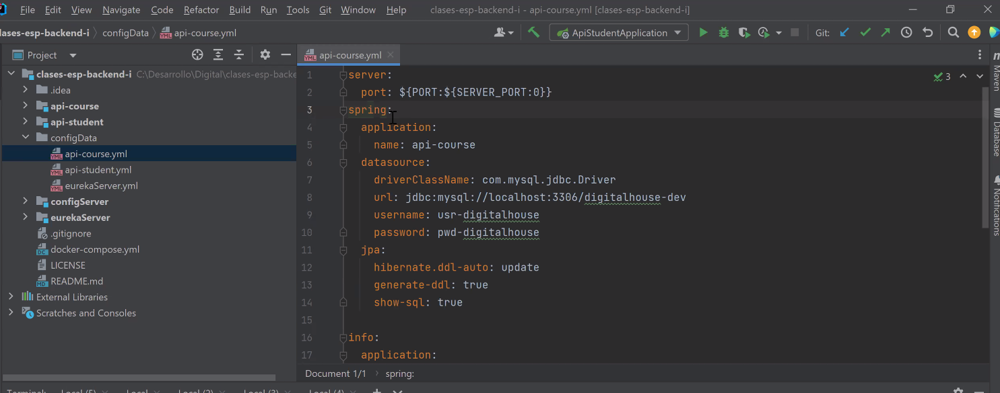
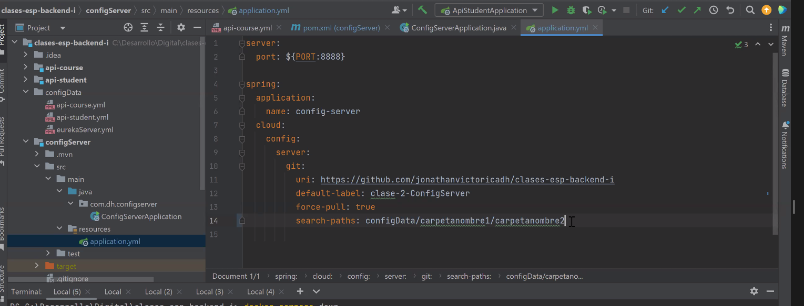
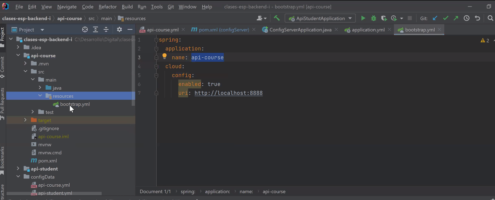
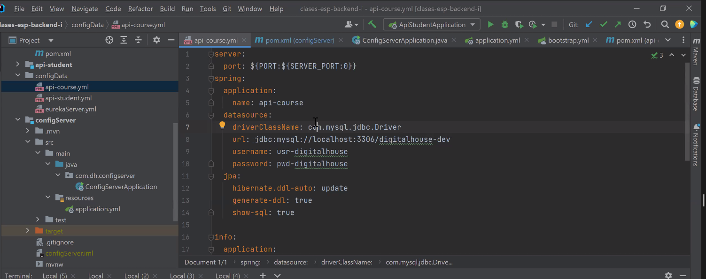
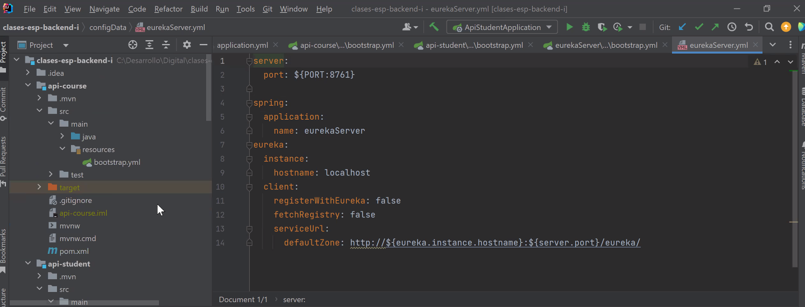
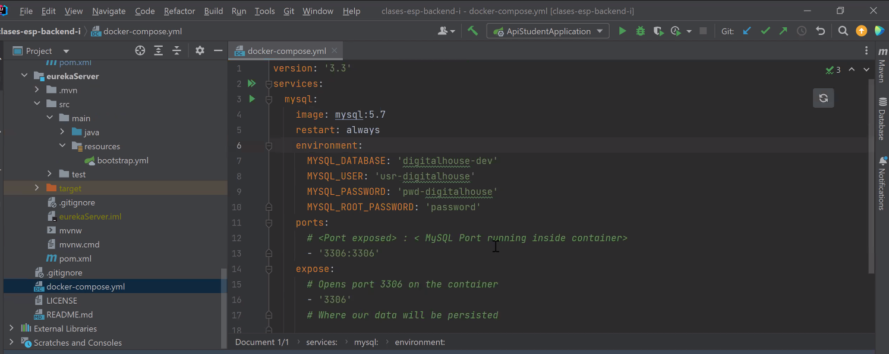

### Proyecto multimódulo:
cuando un proyecto nace como un microservicio que llega un momento q le metemos mucho código y termina siendo como monolítico. entonces si no tengo ganas de copiar clases o generar librería externa, java 9 incorporó algo q permite dividir un proyecto en módulos q pueden ser liberrías o microservicios q pueden esxponer endpoints
clientes premium y cliente básico puede compartir mucho, entonces creo algo como api core o cliente core donde no quiero crear ago externo y ponerloe n un maven, entonces dentro de un proyecto java uso distintos módulos y cuando se deploya, se deploya como 2 jar distintos. ACÁ NO LO VAMOS A USAR pero PARA TAREA!!

Permite centralizar las configuraciones de los microservicios y todos los archivos de config van a una carpetita. Voy a tenter un servicio springboot y cuando estas inician, en vez de leer el propio application properties van entonces a CONFIG SERVER.

springboot crea una librearía

[un microservicio que escala tiene va a tener múltiples isntancias, cuando levanta una instancia, va ir al configserver, y va a tomar la configuración del microservicio al que esa instancia corresponde]

La configuración (el repo de la configs) tiene que ser público, si fuera privado tendría que tener las credenciales de git. Cuando se haga el paracial vamos a tener q crear un **público**.

Cómo armar el config server:
1) sO bien se crea el proyecto dsede start.spring.io
   1) java, maven, versión mínima y dependencia de CONFIG SERVER + ACTUATOR (en este caso el web.. capaz no, si bien expone controllers la libreriái de spring cloud lo tiene interno todo lo que necesita exponer el server)
   2) usar la versión de jaa 2.75 que es la q usamos en clase
2) A nivel de anotaciones: @EnableConfigServer
3) resources>application.yml

Config server es un servicio que no va aregistrarse en eureka, va a estar como por afuera del sistema de eureka porque eureka va a ir a él a buscarlo

El branch lo toma como algo distinto por eso el label va al nombre del branch.

LA IDEA ES QUE VAYAMOS USANDO DISTINTAS RAMAS PARA CADA APPLICATION
    uri: es el repo
    **default-label:** acá va la rama si lo tengo en el mismo branch, ponele main, ahí no va nada, pero si lo tengo en una rama, entonces tengo q indicarlo.
    force-pull: true
    search-paths:

4) Agarrar todos los applications de los microservicios, cada micro tiene un nombre y los yml tengo que llamarlos, NO CON EL NOMBRE DEL MICROSERVICIO, sino con el nombre que le haya puesto al archivo bootstrap.yml (por ejemplo el microservicio api-course tiene en la carpeta resources bootstrap.yml) es un nombre distinto del de eurka server
HAY QUE PONER UNA LIBRERÍA **SPRING-CLOUD-STARTER-BOOTSTRAP**; esta es la librería que se encarga de ir a buscar la configuración
  

   --> puerto 0 porque va a ser dinámico

  En el bootstrap yml le pongo enable true y la uri que es el localhost y el puerto que va a ser el del config server.

