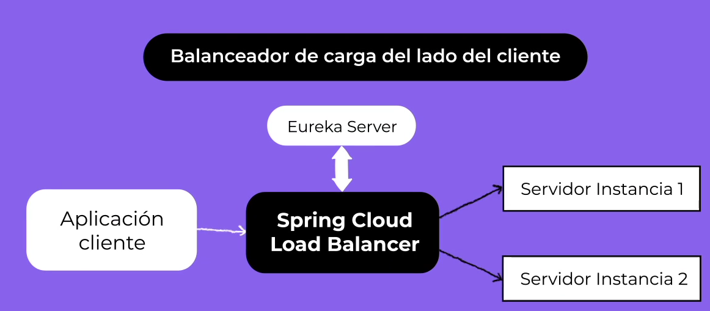
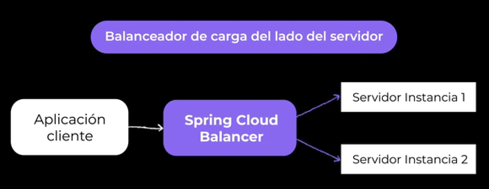

### Introducción a Feign

Ya hemos visto cómo resolver diferentes problemas en las arquitecturas de microservicios, como la utilización de Spring Cloud API Gateway para tener un único punto de entrada a nuestro ecosistema de microservicios, Eureka para el registro y descubrimiento, Spring Cloud Config para centralizar la configuración, entre los componentes más importantes.

Generalmente, los microservicios exponen una API REST. Ahora, vamos a ver cómo podemos comunicarnos entre los microservicios utilizando el protocolo HTTP, aprovechando las ventajas de utilizar Eureka en conjunto de un balanceador de carga para equilibrar las peticiones.

### ¿Qué son las invocaciones declarativas?

Las invocaciones declarativas han sido creadas para facilitar la integración entre microservicios mediante la creación de clientes HTTP de forma declarativa. Esto significa que se simplifica la invocación entre estos microservicios. El desarrollador simplemente necesita crear una interfaz y configurarla mediante anotaciones. No se necesita programar toda la lógica de conexión e invocación de una API, sino que simplemente se declara escribiendo anotaciones en los métodos que necesitamos invocar y/o exponer.

Feign nos servirá para hacer invocaciones declarativas y es un componente que originalmente fue desarrollado por Netflix. Actualmente, se integró dentro de los componentes de Spring Cloud, rebautizado como  **Spring Cloud OpenFeign** . Gracias a la integración con Spring Cloud, dentro de sus ventajas podemos destacar:

- **Autodescubrimiento**: utilizando Eureka, podemos hacer llamadas a los microservicios utilizando el nombre en lugar de una URL formada por IP y puerto.
- **Balanceo de carga**: podemos integrar Feign con un balanceador de carga como **Spring Cloud LoadBalancer**.

Ver PDF con configuración

### Balanceo de Cargas

El balanceo de carga es el proceso de distribuir el tráfico a través de diferentes instancias de la misma aplicación.

Cuando se tiene un sitio en un servidor y comienza a recibir visitas, el servidor a medida que esto aumenta, puede realentizarse o no responder.
Frente a eso se puede escalar Verticalmente, aumentando la capacidad del CPU, memoria aunque esto tiene un límite
Entonces, podemos escalarlo **HORIZONTALMENTE** aumentando la cantidad de servidores de esta manera se satisface la demanda.
Pero ¿cómo hacemos para que nuestros clientes lleguen a los nuevos servidores y sepan cuál es el mejor para procesar su solicitud?
La respuesta la vamos a tener mediante un balanceador de carga.

El balanceo de carga se refiere a la  **DISTRIBUCIÓN EFICIENTE DEL TRÁFICO DE RED ENTRANTE** a través de un grupo de servidores de backend. Un balanceador de cargas enruta las solicitudes ENTRANTES de los clientes a través de todos los servidores capaces de satisfacer esas solicitudes, maximizando la capacidad y velocidad de procesamiento, intentando que ningún servidor esté sobrecargado de trabajo, lo que podría reducir o anular su rendimiento. 

Si un servidor deja de funcionar, el balanceador de cargas redirige el tráfico a los otros disponibles y cuando se agrega uno nuevo, el balanceador comienza a enviarle solicitudes.

Un balanceador de cargas entonces:
- distribuye solicitudes y cargas de red entre servidorse
- Garantiza una alta disponibilidad y confiabilidad al enviar solicitudes a servidores que están en línea.

Los balanceadores de carga se dividen en:
-  BALANCEADORES DE CARGA DEL LADO DEL CLIENTE: el cliente se encarga de distribuir la carga al enviar la solicitud al servidor. Puede ayudarse con servidor de registro como EUREKA para obtener el listado de servidores disponibles y su ubiación. El beneficio es que no se necesita agregar ningún componente extra para el balanceo de carga y tampoco preocuparnos por la alta disponibilidad del balanceador de carga Además, al evitar enviar la solicitud al balanceador de carga para luego redirigirla al servidor de destino, reducimos la latencia y los costos de infraestructura y mantenimiento.

- BALANCEADOR DE CARGA DEL LADO DEL SERVIDOR: todas las instancias se registran en el balanceador de cargas. El cliete envía la solicitud al balanceador y este resuelve redireccionando una de las instancias disponibles.

¿Cómo decide el balanceador qué instancia es la más adecuada para recibir la solicitud?

MEDIATE ALGORITMOS

- Round-robin: selecciona todas las instancias en el mismo orden 
  - problemas: si nos interesa conservar el estado o datos del cliente, al estar siempre redirigiendo a instancias secuenciales, puede tener problemas de consistencia
- 