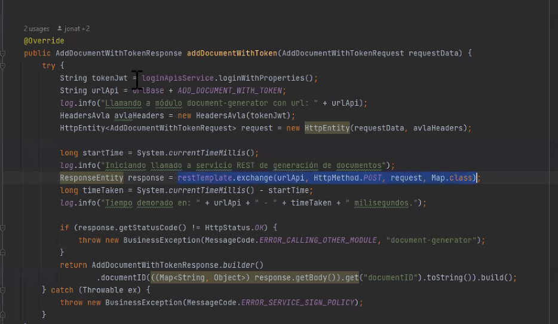
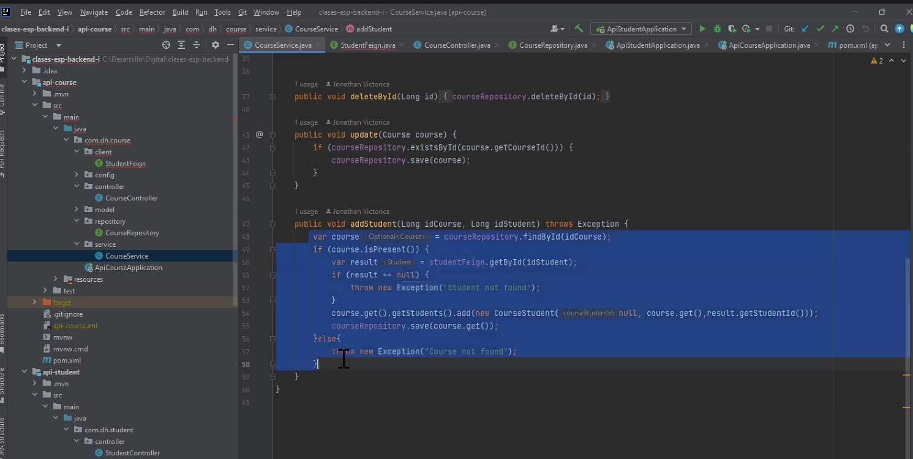
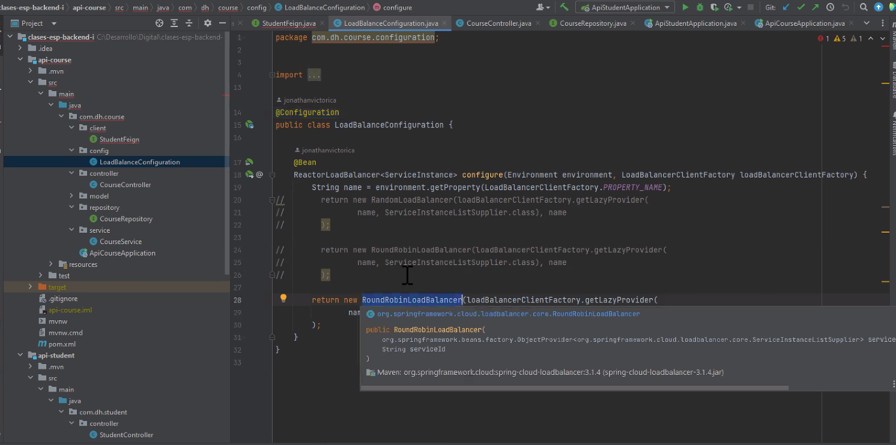
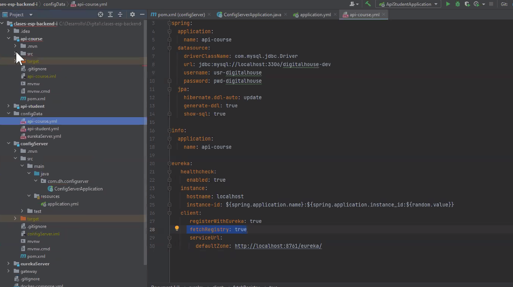
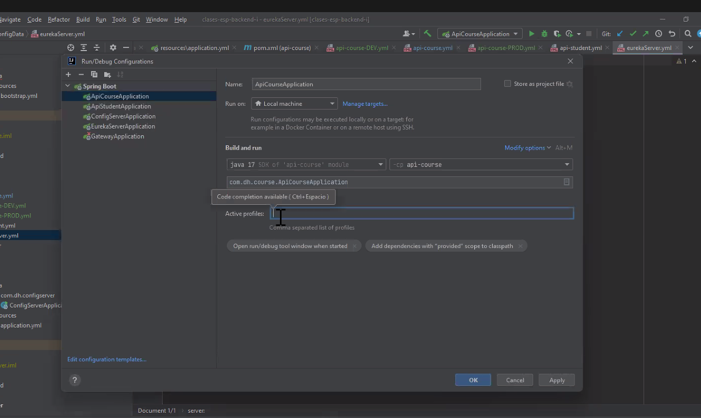
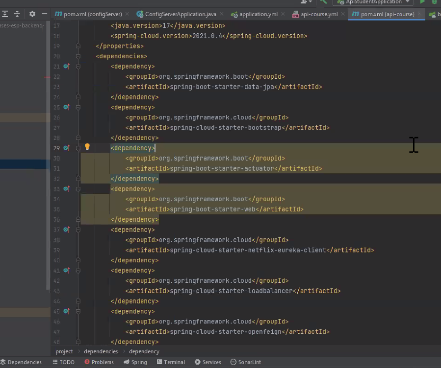

### Consumir un microservicio desde otro

Necesito consumir el controller que expone estudiante (desde curso) dos maneras:
1) REST TEMPLATE es una clase de rest tempalte que tiene una serie de métodos. Le cpongo la url  el método que quiero consumir, el request
   La respuesta más común de esto es una list.
   

2) FEIGN es una interfaz declarativa @FeingClient de la librería open Feign  puedo poner nombre, url y métodos 
   1)  en la clase principal @EnableFeignClient es omo el @service para saber que tiene que construir por atrás una case que implementa la ejecución del microservicio
   La interfaz se usa en el service como el repository de jpa. Lo uso como si atrás hubiera una clase que lo implementa.
   No le especifiamos la url a la que le tiene que pegar porque estamos usando EurekaServer porque no tengo ni la más mínima idea de dónde levantó la clase.

Una propiedad en el config-file

LoadBalanceClient: lo que me dice es que vaa obtener las url y a través de un criterio de balanceo de carga, se va a quedar con 1.

Una manera de configurar es especifico el algoritmo.
Otra es a través del archivo de configuación yml para cada url
La librería es LOAD BALANCE. Spring tiene otra librería que se llama ribbon que por defeto trae el random para pegarle a las urls (en gral parece q es el random el por defecto).

(otra forma es programar una lógica que con metricas disponga a qué instancia pegarle. Lo más común es round robin nosotros estamos viendo una librería que simula un entorno en la nube... como puede... las métricas ponele aws las tiene)

1) crear un sprigboot vacío conl alibretía de config server. 
2) agregar el actuator
3) en la clase principal enableconfigserver (debería tener una carpeta config que tuviera la anotación y en la clase tengo la descripción)
4) en el applicationyml ahí tendría el nombre

Para tener distintos archivos de configurafción por ambiente:
dev
prod

tengocategoría de archivos:
api-course
api-course-DEV
api-course-PROD

como que "heredan" de api-course que va a tener todo lo que se repite. Al ponerle el - entiende que es un ambiente particular

