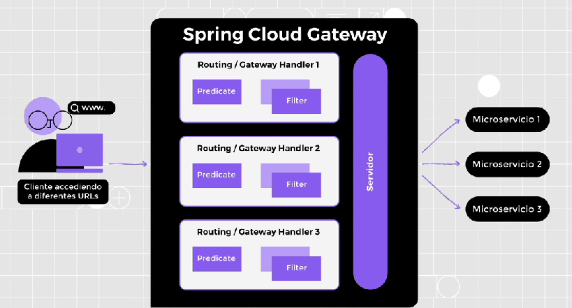
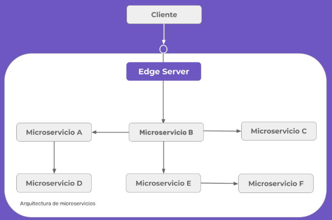

### SPRING CLOUD GATEWAY

Resuelve el problema de cómo le daremos acceso a las personas usuarias a nuestros microservicios destinados a ser consumidos por un sistema externo y no a todos los servicios de la aplicación.

Spring Cloud Gateway es una fomma de implementar el patrón EDGE SERVER que es un proxy que otorga únicamente permiso a los microserviciosiscreados para ser consumidos desde sesistemas externos al ecosistema de microservicios. Esto garantiza el encapsulamiento y la seguridad de nuestros microservicios también nos da la posibilidad de implementar en nuestros gateway ciertas reglas de negocio comunes a todas las peticiones (temas de seguridad o logueos) este principio se denomina **CROSS CUTTING CONCERNS**

|CADA MICROSERVICIO NO CONOCE EL GATEWAY, EL GATEWAY CONOCE A LOS MICROSERVICIOS|
|--|

Existen 3 conceptos básicos:
1) ROUTING/GATEWAY HANDLER: es el destino que vamos a asignarle a un request particular, se asociará con una URL si cumple con determinadas condiciones especificadas en los componentes de prediate y filter

2) PREDICATE: condición que debe cumplir el request (por ejemplo si tiene en los datos del header cierto atributo o si el path de url tiene cierto valor)
3) FILTER son instacias de Spring Web Filter y son interceptores que se ejecutan en cadena antes de ejecutar la lógica de negocio asociada al endpoint en estos filtros se pueden modificar datos de request y de response como por ejemplo interpretar un tokken de seguridad o logear información genérica. 

podemos decir que Spring Cloud Gateway es un microservicio que actúa como frontera con los demás microservicios de negocio. Establece reglas de navegabilidad de acuerdo a la persona usuaria y sobre esas peticiones, puede agregar filtros, seguridad o bien información relevante para el servicio final.

Introducción
En síntesis, este patrón nos permite comunicar el mundo exterior con nuestro ecosistema de microservicios, teniendo acceso solo a los microservicios que necesitan ser consumidos por un usuario externo —entendiendo al usuario como una aplicación de front end, un sistema monolito, etc.—, con el objetivo de proteger la integridad y uso de nuestras API. A continuación, les recordamos una imagen que vimos en las primeras clases que será de utilidad para lo venidero.

