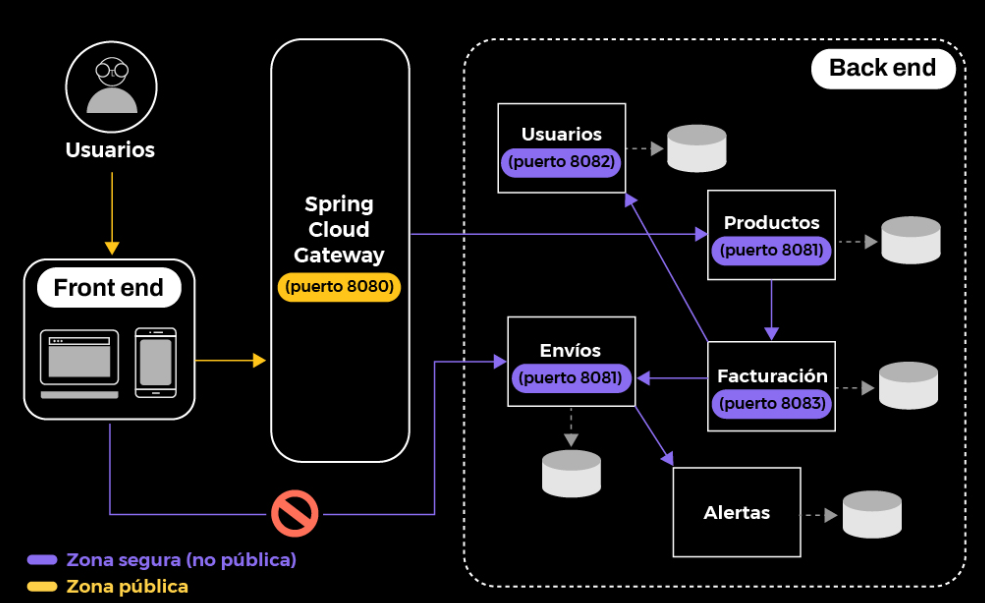
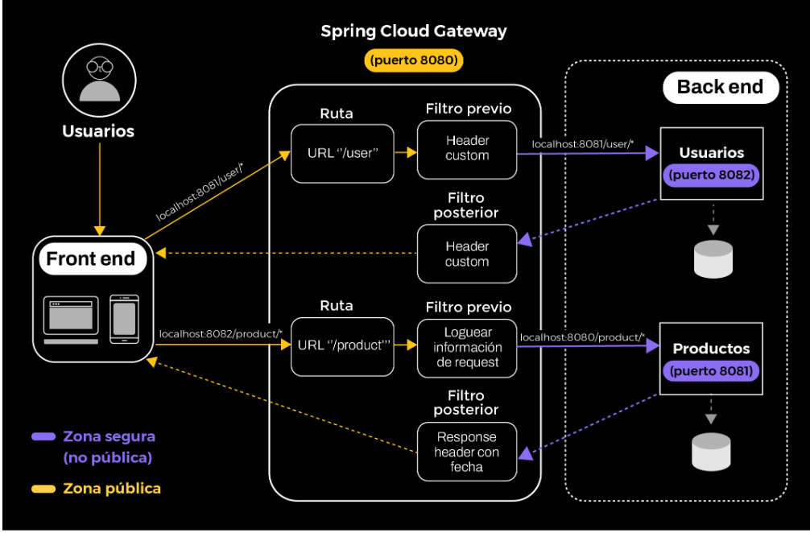

## SPRING CLOUD GATEWAY

Resuelve el problema de cómo le daremos acceso a las personas usuarias a nuestros microservicios destinados a ser consumidos por un sistema externo y no a todos los servicios de la aplicación.

Spring Cloud Gateway es una fomma de implementar el patrón EDGE SERVER que es un proxy que otorga únicamente permiso a los microserviciosiscreados para ser consumidos desde sesistemas externos al ecosistema de microservicios. Esto garantiza el encapsulamiento y la seguridad de nuestros microservicios también nos da la posibilidad de implementar en nuestros gateway ciertas reglas de negocio comunes a todas las peticiones (temas de seguridad o logueos) este principio se denomina **CROSS CUTTING CONCERNS**

|CADA MICROSERVICIO NO CONOCE EL GATEWAY, EL GATEWAY CONOCE A LOS MICROSERVICIOS|
|--|

Existen 3 conceptos básicos:
1) **ROUTING/GATEWAY HANDLER**: es el destino que vamos a asignarle a un request particular, se asociará con una URL si cumple con determinadas condiciones especificadas en los componentes de prediate y filter

2) **PREDICATE**: condición que debe cumplir el request (por ejemplo si tiene en los datos del header cierto atributo o si el path de url tiene cierto valor)
3) **FILTER** son instacias de Spring Web Filter y son interceptores que se ejecutan en cadena antes de ejecutar la lógica de negocio asociada al endpoint en estos filtros se pueden modificar datos de request y de response como por ejemplo interpretar un tokken de seguridad o logear información genérica. 

Podemos decir que **Spring Cloud Gateway** es un microservicio que actúa como frontera con los demás microservicios de negocio. Establece reglas de navegabilidad de acuerdo a la persona usuaria y sobre esas peticiones, puede agregar filtros, seguridad o bien información relevante para el servicio final.

## Introducción
En síntesis, este patrón nos permite comunicar el mundo exterior con nuestro ecosistema de microservicios, teniendo acceso solo a los microservicios que necesitan ser consumidos por un usuario externo —entendiendo al usuario como una aplicación de front end, un sistema monolito, etc.—, con el objetivo de proteger la integridad y uso de nuestras API. A continuación, les recordamos una imagen que vimos en las primeras clases que será de utilidad para lo venidero.

___

## Introducción a Spring Cloud Gateway
La solución de **Spring Cloud** nos provee de un framework llamado  **Spring Cloud Gateway**  que implementa el **patrón Edge Server** y nos brinda varias herramientas para aprovechar este punto en común de comunicación con el ecosistema de microservicios desde sistemas externos.

Recordemos nuestra Fintech de DH que vimos en la primera clase y analicemos la forma de comunicación de la solución.

Como podemos apreciar en la imagen, tenemos dos canales de comunicación: uno público y otro privado. El canal violeta —o seguro— está compuesto por las comunicaciones internas entre microservicios en puertos diferentes al 8080, sobre el cual no tienen acceso desde fuera de la red. Por esta razón, un front end no podría invocar a estos servicios de forma directa. Mientras que el canal amarillo —o público— es utilizado para dar acceso desde nuestro Cloud Gateway al mundo exterior. A continuación, veamos algunas de las ventajas de esta arquitectura.

### Ventajas

1. Implementar de forma transparente capacidades comunes, genéricas a todos los microservicios, conocidas como CROSS-CUTTING concerns, tales como:
   + monitoreo
   + Métricas de uso
   + Autenticación
2. La seguridad e integridad de datos de nuestros microservicios
3. El cliente no conoce el o los microservicios que termina invocando, por ende, no está atado a una dirección HTTP en particular
4. El cliente no tiene que conectarse a los 5 microservicios para obtener una funcionalidad, sino que accede a un único punto para obtener la capacidad de negocio necesaria.
5. Basado en criterios de la petición de usuario (URL, información del header, sesión) se pueden tomar diversas decisiones relacionadas con la navegabilidad.

___

## Componentes de  Spring Cloud Gateway 

|CROSS-CUTTING CONCERNS|
|--|
|En programación orientada a aspectos, los cross-cutting concerns son funcionalidades generales de un programa que afectan a otras funcionalidades núcleo del programa, sin ser ellas mismas parte de ese núcleo de funcionalidades. Por ejemplo, en un a palicación para la gestión de registros médicos, el idnexado de esos registros es una función "núcleo" (o core) a ese sistema; mientras que el seguimiento de los cambios realizados sobre esos registros, alautenticación de usuarios o el encriptado de datos serían cross-cutting concerns. Hacen a la funcionalidad, pero no son el core del sistema.