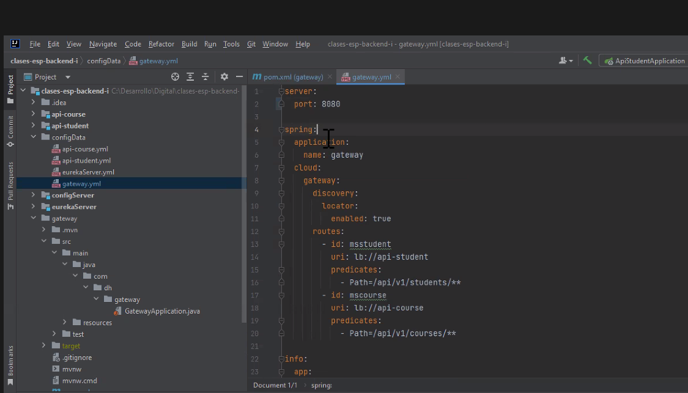

Solamente pongo los endpoints que estoy interesado en que la gente consuma (pensar en el parcial).
Incorporar una apimás, el pom tiene el spring gateway y va a buscar la config a config server es cliente de eureka, nos e registra, pero es cliente (el cliente lo tiene q tener) tiene la librería de balanceo de carga

Integro con eureka porque puede haber más de una instancia de nuestros micros y la idea es poder aprovechar (funciona igual sin eureka, pero lo combino con esta soludión para aprovechar el escalamiento) 
le pongo el puerto y le agrego configuración adicional no toco los otros micorsoervicios solamente les pongo el ruteo a los microservicios

docker compose up
mvn clean spring-boot:run

