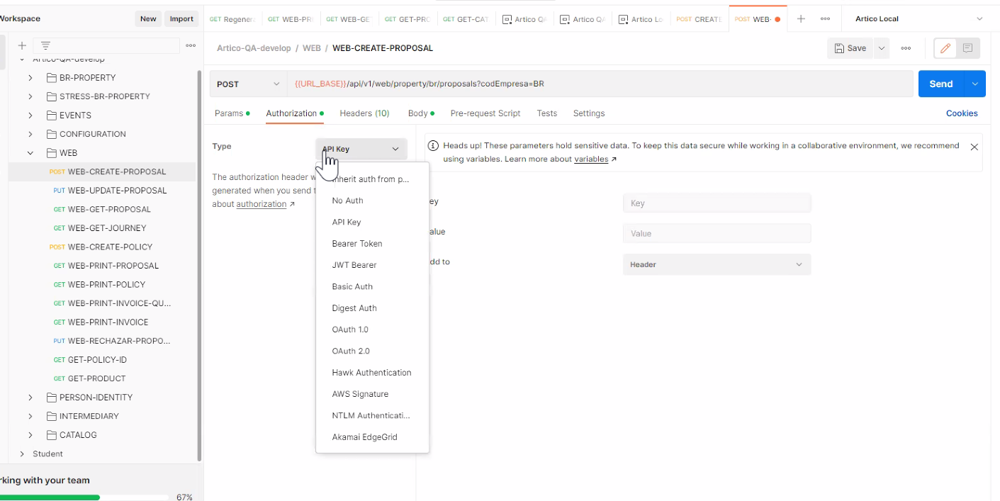
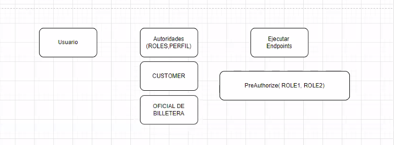

Para asegurar el microservicio:
- token: jwt /bearer
- basic Auth: usuario+pass
- API key

En postman está para usar los distintos protocolos de seguridad, están los más comunes.
¿Porqué usaría una en vez de la otra? si bien elt oken(usuario/pass) pueden tener que ver, el tokken está codificado y por lo tanto menos expuesto usario y pass, pero voy una sola vez, no por cada endpoint que tengo en mi sistema. VOy aun sevicio de autenticación y uso eso para todo.

### Elementos de un tokken:
- fecha de expiración
- usuario
- algoritmo de encriptación
  

Usuario         Autoridades (Roles/Perfil)          Ejecutar endpoints
                    Cliente
                    Oficial de billera
cada uno tiene distintas funcionalidades. 
En java hay una anotación @PreAutorizer

La autenticación puede también "delegar"  el checkeo de identidad en un proveedor al que le tengo confianza. x ej, google. 
El usuario va a ir con ése proveedor de identidad (google) y entonces, tengo mis endpoints securizados,  entonces, primero le voy a pedir al usuario que vaya al proveedor de identidad, entonces el proveedor va y gestiona un tokken que le da al usuario, nosotros validamos ese tokken, vemos qué roles tiene y vemos que además de autnticado, esté autorizado para ciertas tareas.

Yo tengo que registrarme primero en google y pedirle que siempre me mande una serie de datos de los clientes. Todos esos datos se llaman SCOPE. Son como partecitas que el usuario tiene. Me va a decir ud autoriza que xxx datos sean compartidos con xxxx si digo que sí, con el tokken me "salvé" de validar password sino que además me traje datos precargados que no los almaceno (como proveedor de servicios) en mi base de datos de usuario, directamente con pido al proveedor de identidad y es él el que guarda la info.

Existen protocolos fuertes de seguridad que utiliza el proveedor de identidad con las apis/microservicios.
Opend ID
SAML
OAuth2

------------------------------------EJEMPLO-----------------------------------------------

pARA USAR SPRING SECURITY

1) dependencias de jwt y spring security
2) 