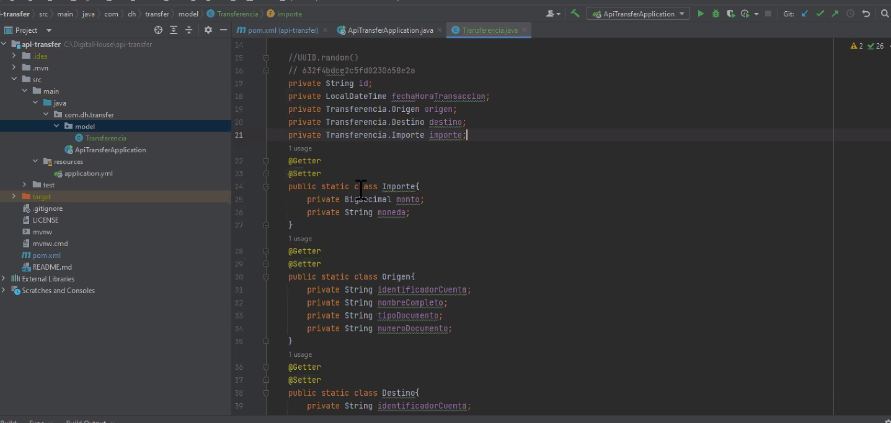
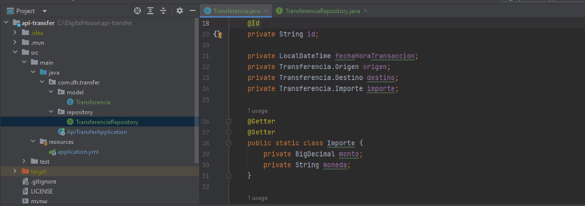
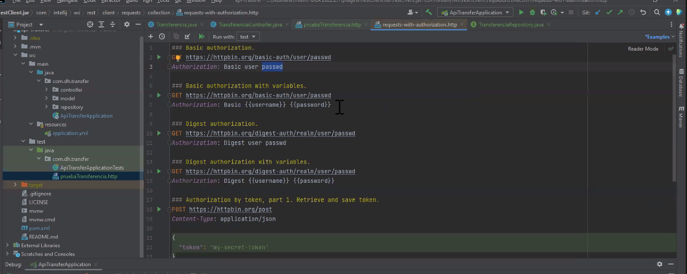
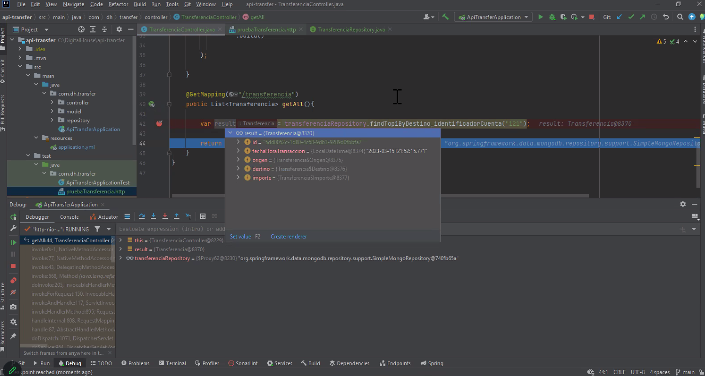
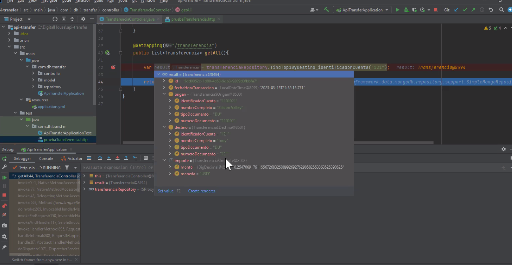

Permite mayor libertad

- Mongo
- FireBase
- Dynamo
- ElasticSearch
- DocumentDB
- REDIS es una base de datos clave-valor que se considera no relacional
- 
El resto es orientada a documentos, acá voy a tener COLECCIONES en vez de tablas y en vez de Registros son DOCUMENTOS

Los documentos en Mongo se representan con un Json que se un mapa clave-valor
Permite hacer anidamiento de varios tipos, objeto, lista. En una base de datos no declaro estrutura, pero en una colección( si bien la base es flexible), conviene hacerlo, porque sino se genera caos. Si yo nomantengo un orden cuando la base crece puede generar problems.

Es raro que un sistema esté todo en No relacional. La mayoría tienen hybridos. Los sistemas que tienen más de una base de datos de diferente tipo se denominan: POLIGLOTA (persistencia políglota, también se usa cuando tengo más de un motor de base de datos).

Hace años se trató de crear una bdd orientada a objetos pero no funcionó y lo más parecido son las no relacionales.

------

Ejemplo
-------

UUID (ver video)
La clave es un string (sobre todo para el framework que se va a usar)

//UUID.random()
private String id;
private BigDecimal monto;
private LocalDateTime fechaHoraTransaccion;
private string identificacionCuenta;
private String nombreCompleto;
private String 

si tuviera bdd relacional tendría origen etc, ahora me premite que el atributo sea un objeto

ahora creo un objeto:

private Origen origen;
private Destino destino;

private Importe importe; vaa a tener como dato moneda y valor

creo clasees origen y destino (se puede usar herencia!!) pero la idea es ver que se puede guardar objeto.

Cuando creo una clase, esa clase puedo crearla donde estoy trabajando (ahí en el model) si se hace quilombo, lo puedo extraer. Si origen lo voy a usar en otra clase, creo un DTO aparte, sino lo pongo en la clase donde estoy trabajando. Ahí también creo los getters/setters

El objeto transferencia es complejo porque tiene otras clases, entonces lo que hago con este objeto complejo, lo guardo así nomás, como objeto en MongoDB.
Para bdd normales uso spring JPA y el driver de mysql (que ayuda a conectar) y el Hibernate (si quiero usar las anotaciones incluido en jpa)

Para MOngo agrego 3 dependencias:
- starter data mongodb
- javadriver
- flapdoodle (para zafar de instalar mongodb, docker esta librería embebe la base de datos y la crea en memoria, sería como un H2, pero de mongo)
crea una bdd muy básica que se llama test y la expone en el 27017
en el application.yml copio y pego:

spring:
    mongodb
        embedded:
            version: 4.0.2
    data:
        mongodb:
            database: test
                port: 27017

hay un @DBRef --> una referencia que trae un rol trae x id

En un controller ahora hago un save un find (uso el @builder para construir el objeto de manera más amigable)

el builder es una manera más fácil, lo que haces es un new transferencia y voy poniendo .id .fechahora... etc queda más legible

debería hacer un service para hacerlo más prolijo.

funciona perfecto pero los datos no se guardan porque es una bdd en memoria

https://github.com/jonathanvictoricadh/api-transfer

