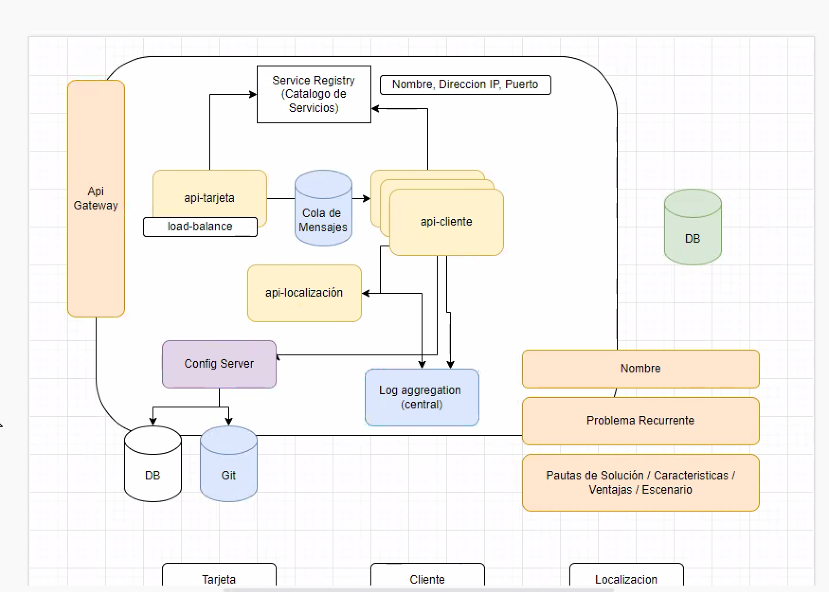

M## Planteo de la clase: 

Planteo 2 microservicios

API-TARJETA
 
API-LOCALIZACION
 
API-CLIENTE

Estos son microservicios de negocio

vamos a suponer q los 3 micros se conectan a = bbDD

Los patrones tienen:
- nombre
- problema recurrente
- pautas de solución
- características
- ventajas 
- escenario
- cuándo es que se da este problema

### SERVICE REGISTRY & SERVICE DISCOVERY

- nombre service registry
- problema recurrente: cuando levanto un microservicio, sé de antemano la ip y localización y si tengo q consumir otro microservicio

tarjeta tiene q conectarse con cliente para saber si existe y cliente con localización
Si tengo q pegarle de una api a otra, necesito saber dirección y puerto. Y si lo tengo que poner en nuestro microservicio, se pone en el ***application properties***. 
Este patrón plantea que si todo escala y tengo un escenario crítico, lo que puede pasar es que se caiga el microservicio. 
Lo que esto me dice es que si mi ejecución escala, y se ejecuta en paralelo, cada petición va a caer en una instancia diferente de la misma api. Entonces esto, que forma parte de una nube elástica (autoescala), la api-cliente, ni debería enterearse cuántas instancias tengo.

Este patrón de registro, me ofrece como solución que cada instancia "anuncia" a sí misma en un servidor de registro (service registry)

Es como que en el medio meto un catálogo de servicios que guarda toda la info, es decir, nombre, ip, puerto, etc 

El patrón funciona: cuando necesito q mi microservicio escale y q la api cliente no se entere, la api se "registra api-cliente lhost inst1, inst2... etc hasta la cantidad de instancias que hayan hecho petición.

Si mi microservicio se murió, el registro se entera y lo da de baja (con todas sus instancias).

El catálogo hace de intermediario.

- pautas de solución
- características
- ventajas 
- escenario
- cuándo es que se da este problema

Eureka server me da 2 librerías:
una para el cliente y otra para el servicio

-----

## EDGE SERVER

Oculta servicios que no deberían estar visibles para el usuario.

Si bien mi estructura es de microservicios, al consumidor externo no le interesa y capaz hasta tengo microservicios que son de uso interno. Entonces meto un **gateway** que filtra peticiones. Es un servicio de puerta de entrada a la solución, entonces voy a encapsular toda mi solución. Nadie pasa a mis servicios si no entran x el gateway.

- Centraliza config de seguridad
- una api gateway expone 1 sola url y da la impresión de cuando le pega a cualquier endpoint va a ser "la misma url" y el consumidor no va a ver que en realidad son distintos microservicios. Se oculta la descomposición final de mi solución. Lo que gateway me va a dar es un ruteo interno a cada microservicio

_______
 ## CENTRAL CONFIGURATION

Relacionado con la centralización de la configuración. Si yo tengo que cambiar la configuración x ej de la base de datos, q es la misma para las 3 apis, si se modifica es más fácil de gestionar.

Yo tengo q venir con mi microservicio y pedir la configuación al config server que necesito. 
Por ejemplo en una BD o GitHub ahí voy a tener ponele mis archivos de applicationProperites. Habría varios applicationProperties dentro de x ej la BD o GitHub. 
Si cambió x ej la dirección de un servicio externo o una propiedad transversal a varias aplicaciónes, en vez de ir a cada uno de los 3 o 50 microservicios q lo comparten, voy directamente a los archivos de configuración que están en este Config SErver

**Configuración centralizada, agiliza el mantenimiento.**

____

## LOG AGGREGATION

Permite poner todos los logs en 1 solo lugar para evitar que se pierdan.

Centralizar los logs. Cuando se levanta el springboot levanta logs, en algo multiple instancia, cada instancia que se ejecuta va a levantar su microservicio. Los logs pueden configuarse en cuanto a su output (consola, archivo...). Si por ej. tengo un error en api cliente a mí lo q ue me salta es que tengo un error ponele en el registro de cliente y eso puede involucrar ponele 5 microservicios. Si puedo centralizar todos los logs, con log aggregation me va a dar un dashboard donde exponga con mayor claridad dónde, cuál es el microservicio, qué es lo que está fallando

Esto presenta una interaz gráfica. En vez de traer archivos sueltos, envía todo el log. 

___
## Distributed tracing

Parecería ser lo mismo, pero no.

El cliente le pega a la tarjeta (invocó el microservicio tarjeta) para hacer un débito. Se consulta si el cliente existe (api cliente) me pasó la ubicación y tengo q saber si es cercano (api loc) si api localización ponele está caída, lo puedo ver x logs normales o por otro tipo. toda esta serie de pasos sería una OPERACIÓN que está compuesta por una SERIE DE TRANSACCIONES y una de esas falló.

Si implemento este patrón, en el header del reqeuest va un ID de operación y cada transacción también va a tener un ID. Voy a tener un dashboard ocn el id de la operación donde voy a tener un gráfico con el "camino" que siguió cada transacción. No voy a ver el error, pero me va a indicara en qué parte de la operación falló y esto lo puedo combinar con el LOG AGGREGATION.
(Patrón complementario del log aggregation)

sirve para fallas en ambiente productivo

Es una manera más gráfica de ver las conexiones entre mis componentes. Si quiero tener una visión más macro, lo voy a ver con este pattón. Desde qu se activa la operación hasta q termina se maneja 1 solo ID de operación. 

básicamente lo muestra más a nivel MACRO.

___

## Centralized monitoring and alarms

Define 2 cosas, 1 un monitoreo x métricas del microservicio. cómo viene de memoria, operaciones, transacciones. Si tengo un micro, q implementé recién y falla, me sirve tener un dashboard que me alerte si tengo un problema y dé una alarma donde me alerte qué falla.

Básicamente es recopilar en 1 solo lugar la "salud" de todos los microservicios. En JAVA tengo una librería. 

Se puede implementar para operaciones q estén en los microservicios. x ej la operación de débito tiene alarma, ahí veo más en detalle.
___

## circuit break

Si un microservicio deja de funcionar, deja de enviar peticiones.

este patrón invita a HACER UN PLAN B
si una opearción falla, qué camino tomo:
- la cancelo?
- hago otra cosa?
- redirijo?

Este patrón refleja la tolerancia a fallos, rsiliencia.

Esto permite tomar las medidas necesarias para que cuando consumo de un micro a otro de micros q están bajo mi órbita, si hubo x ej un microcorte, si tengo este patrón, me permite x ej hacer reintentos,x ej probar 10 veces... 
y ahí corta la opración. Pero si x ej al 3ro levanta, me salvó la operación. Contemplo q el cliente se puede caer, entonces tengo un plan de acción. si la rechazo o la "guardo en algo" de costado para q en 5' o en 10' vuelva a intentar.

COMUNICACIÓN ENTRE MICROSERVICIOS

LA COMUNCIACIÓN PUEDE SER SINCRÓNICA O ASINCRÓNICA que puede ser a través de una interfaz (cola de mensajes) una queue.
No es tan lineal saber cuándo implementarlo y cuándo no. Hay sistemas donde la comun sincrónica no existe sino q tood es a a traves de eun a cola q me permite ser más tolerante al fallo. voy a ver q la operación se ejecute de punta a punta, y tratar de salvar lo que pueda pasar a nivel de componentes y ver si conviene algo sincro o asincro.
ESTO ES UNA ARQUITECTURA ORIENTADA A EVENTOS (lo vamos a ver al final de la materia).

La solución final va a tener 

Todo esto puede armarse con spring cloud. 

__

cada patrón es como una lista de librerías. No es la única forma de implementarlo. Si voy a otro lenguaje, tengo otra librería. Los PATRONES SON AGNÓSTICOS AL LENGUAJE!! es decir, existe en cualquier lenguaje de programación. Spring es más simple y no presenta complejidad a la hora de usarlo y en esta instancia es una ventaja. 

No necesariametne se usen todo porque mucho capaz viene del equipo de DEVOPS x ej, apigateway, load balance... con spring cloud, si bien vamos a tener algo agnóstico a la nube en la que se ejecuta. En forma local se puede simular. 

Config server ponele, es fácil de implementar con cualquier librería, mientras se respeten las pautas del patrón.

