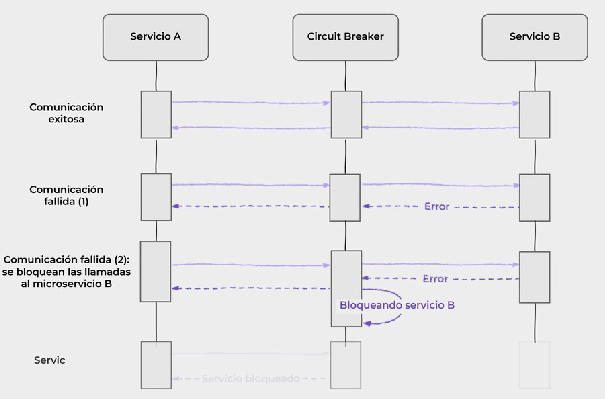
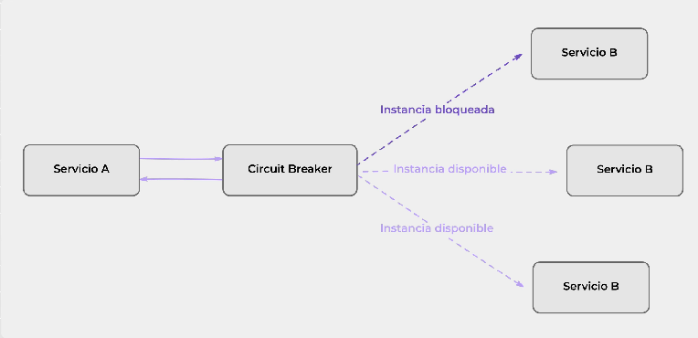

## Patrón Circuit Breaker

### ¿Qué es la tolerancia a fallas?
Cuando pasamos de construir sistemas monolíticos a microservicios, una de las primeras cosas que notamos es que cada uno de los componentes que se encuentran en nuestro ecosistema de microservicios es parte de una red. Y comunicarnos a través de una red puede traernos problemas que antes ignorábamos, ya que pasamos de tener una única aplicación en ejecución a varios componentes independientes que tienen que trabajar en conjunto para garantizar el correcto funcionamiento del sistema. Cuando hablamos de tolerancia a fallas en sistemas distribuidos, hacemos referencia a la capacidad del sistema para continuar en funcionamiento si alguno de sus componentes falla.

### Patrón Circuit Breaker
A continuación indagaremos más sobre el patrón Circuit Breaker que vimos en la clase 2

#### Problema
Un sistema de microservicios que se comunica sincrónicamente puede estar expuesto a una cadena de fallas. Si un microservicio deja de responder, sus clientes también pueden tener problemas y dejar de responder a las solicitudes de sus clientes. El problema se propaga recursivamente a través del sistema, provocando fallos en cascada.

#### Solución
Evitar enviar nuevas solicitudes a un servicio si detectamos un problema. Para comprobar el estado de los microservicios, utilizamos un Circuit Breaker que actúa de intermediario en la comunicación.

----
(video)
Circuit breaker: cuando tenemos un ecosistema de microservicios interconectados, si uno falla, produce una reacción en cadena. El objetivo del patrón es evitar que esto suceda.
 
El objetivo es supervisar el estado de la comunicación entre microservicios.
Si un microservicio falla, se bloquean las comunicaciones a ése microservicio.

Una vez que se cumple cierto tiempo vuelve a activarse.

Podemos configurar cuántos errores vamos a querer permitir antes qde que se bloquee el acceso al servicio.

Si lo configuro para que falle 2 veces, si al intentar comunicarse lanza error o time out, entonces el circuit breaker cerrará el circuíto.

En arquitectura de microservicios, debemos contemplar esto y AUMENTAR LAS INSTANCIAS DE LOS SERVICIOS MÁS DEMANDADOS, entonces, si el circuit breaker bloquea una instancia, se podrán redireccionar las llamadas a otras instancias.

Par abrir nuevamente el circuíto, esto se configura y se le coloca cuánto tiempo se va a esperar hasta abrirlo nuevamente.
Una vez cumplido el tiempo, se le vuelven a mandar peticiones.

Si volviera a falla el contador de tiempo se reinicia.

El patrón permite:
+ Aumentar la tolerancia al fallo
+ Reducir la sobrecarga
+ Monitorear en tiempo real

--> En Spring:  **SPRING CLOUD CIRCUIT BREAKER** 

----

## Los 3 estados del circuit breaker:

Circuit Breaker se considera un patrón de diseño que nos ayuda a evitar fallas en cascaeda y nos permite crear servicios resilientes y tolerantes a  fallas que pueden sobrevivir cuando los principales servicios que consumen experimentan inestabilidades. Circuit Breaker cuenta con 3 estados:

+ CLOSED: cuando está cerrado, todo está comportándose normalmente y las solicitudes están ocurriendo entre los microcervicios
+ OPENED: El servicio ha alcanzado el número máximo de fallas por minuto y -de momento- no se realizarán más solicitudes para evitar que dañe a otros ervicios y darle tiempo suficiente para recuperarse de su inestabilidad
+ HALF-OPEN: También existe un estado medio abierto, que es cuando el servicio está en estado de "alerta" para recibir nuevas solicitudes. Si la próxima solicitud que se reciba en este estado es exitosa, cambiará su estado a cerrado y volverá a funcionar con normalidad. De lo contrario, es decir, si recibe una solicitud y el servicio se comporta de forma anómala, volverá al estado abierto. Luego de unperíodo de tiempo, volverá a estado medio-abierto y repetirá el proceso anterior.

### Comprobando el estado con Actuator
Resilience4j se integra con Actuator (una serie de servicios estándar que otorgan información sobre el estado del servicio) para exponer información sobre el estado del Circuit Breaker en tiempo real de varias maneras:

El estado actual del Circuit Breaker puede ser monitoreado usando el endpoint /actuator/health.
El Circuit Breaker además publica eventos en un endpoint de Actuator, por ejemplo, las transiciones de estados en /actuator/circuitbreakerevents.

## Resilience4J
Inicialmente, Spring Cloud nos ofrecía a Netflix Hystrix como Circuit Breaker. Sin embargo, actualmente, Spring Cloud implementa para esta tarea a una librería llamada Resilience4j. Esta es una librería de tolerancia a fallas de código abierto inspirada en Netflix Hystrix, pero diseñada para Java 8 y la programación funcional

### Conclusión
Para cerrar, podemos mencionar que el patrón Circuit Breaker nos ayuda a gestionar la cadena de eventos o llamadas a microservicios a lo largo del ciclo de vida de una request. Esta gestión se materializa ante la ocurrencia de un error en un microservicio, dando al sistema la posibilidad de recuperarse mediante una serie de reintentos (retry) y, en caso de que los mismos no funcionen, facilita la implementación de un flujo alternativo mediante el mecanismo de fallback.

En el siguiente video, te mostraremos cómo implementar el Resilience4j para el Circuit Breaker y te dejamos un ejercicio para que pongas en práctica lo visto.