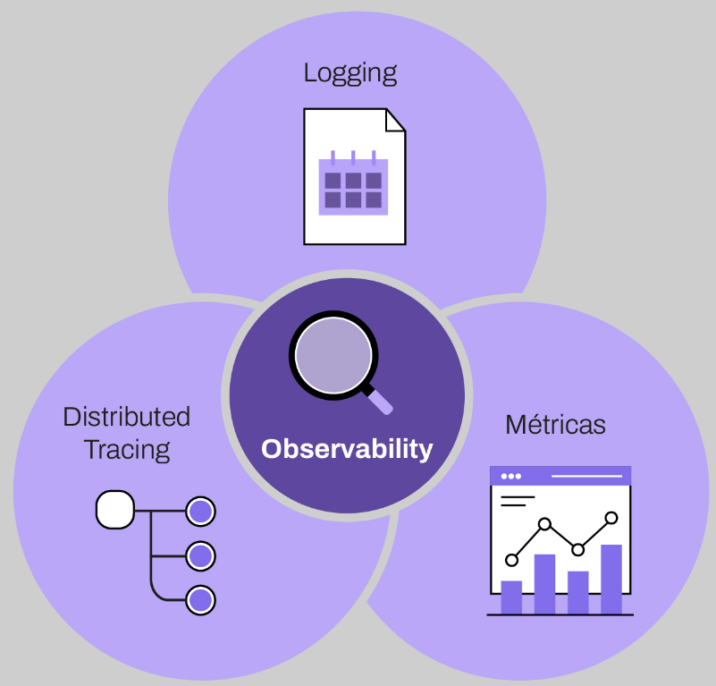

## Distributid Tracing

### Concepto de ***observability***
 Inicialmente, con la adopción de arquitecturas distribuidas —como los microservicios— se vuelve cada vez más difícil diagnosticar, depurar y comprender los errores en producción. 
 
 Para facilitar esta tarea surge el concepto de ***observability***. Este viene a complementar el concepto de monitoreo, que consistía en revisar logs y métricas para controlar la salud de nuestra aplicación. Con el concepto de observability, se añade un jugador más al juego: el patrón Distributed tracing (tracing distribuido).

 

 ____
 (video)

 Distributed tracing (DT) o seguimiento distribuido es un conjunto de:
 - Técnicas
 - Patrones
 - Prácticas
 - Seguimiento de los eventos del sistema y la gestión del seguimiento
  
El DT es un mecanismo para monitorear una solicitud específica en un sistema distribuído en múltiples instancias. Nos permite rastrear cómo avanza una solicitud de un sistema a otro hasta que se completa la solicitud de un usuario o si hay una falla en el camino. 
Como permite la detección de fallas, permite montitorear, diagnosticar, mitigar y corregir las cauwsas de falla o cuello de botello en la performance del microservicios.

En una suseción de llamadas entre A B y C es fundamental saber si fueron exitosas e identificar tiempos de latencia en cada paso del ciclo de vida del sistema.

Para identificar en qué punto ocurre una falla, tenemos que entender que una cosa es dónde ocurre y falla y otra dónde se manifiesta.

|A manda a B un dato inválido y B enonces arroja una exepción. entonces el error ocurre en A y se manifiesta en B.|
|--|

Con DT puedo seguir el camino de una solicitud y mapear dónde ocurre.

---

TRACING ID: Se utiliza para rastrear una solicitud entrante en todos los servicios de composición para cumplir con una solicitud, es decir, será única en todas las llamadas.

SPAN ID: ID identificador individual de cada llamada.


___
## Implementación de Spring Cloud Sleuth


Spring Cloud Sleuth es un subproyecto de Spring Cloud y es un framework ampliamente utilizado para distributed tracing. Al implementarlo en nuestro proyecto, tendremos la generación de identificadores para comunicaciones distribuidas, lo que nos permite realizar análisis individuales y agrupados desde una aplicación fuente. En otras palabras, Sleuth agregará los identificadores (trace y span id) en cada uno de los logs y, luego, con su implementación, los registros contendrán cuatro piezas de información: el nombre de la aplicación que generó el log, el trace id, el span id y la última información en los indicadores si el log se sincronizará con alguna herramienta.

1. Veamos paso a paso la implementación de Spring Cloud Sleuth. Para esta implementación podemos agregar su dependencia en el momento que creamos nuestro proyecto a través del sitio web https://start.spring.io. 
2. Vamos a agregar también la dependencia Spring Web.
3. Solo con fines de prueba, vamos a crear un **controller** que mapee dos solicitudes. En este controller, tendremos dos rutas: Path1 que llamará a Path2 en un puerto fijo 8090. La idea es ejecutar dos instancias separadas de la misma aplicación. 

```java
public class Controller {
    private static final Logger logger = LoggerFactory.getLogger(Controller.class);Value ("${spring.application.name}")
    private String applicationName;
    public Controller(RestTemplate restTemplate) {this.restTemplate = restTemplate;}

    @GetMapping("/path1")
    public ResponseEntity path1(){
        logger.info("Request at{} for requet /path1", applicationName);
        String response = restTemplate.getForObject(url "http://localhost:8090/service/path2", String.class);
        return ResponseEntity.ok("response from /path1 +" +response);
    }
    @GetMapping ("/path2")
    public ResponseEntity path2(){
        logger.info("Request at {} at /path2", applicatonName);
        return ResponseEntity.ok("response from /path2");
    }
    
    }

```

4. Necesitamos hacer que RestTemplate se inyecte como un bean en lugar de inicializarlo directamente para que Sleuth inyecte encabezados en la solicitud saliente. De esta manera, Sleuth agregar un interceptor a RestTemplate para inyectar un encabezado con la identificación de seguimiento y extensión en la solicitud saliente. 
   
```java
@Bean
public RestTemplate restTempalte(RestTemplateBuilder builder){
    return builder.build()
}
```

5. Ahora, comencemos las dos instancias. Para hacer eso, primero debemos compilar la aplicación a través del comando mvn cleancheck. Luego, abrir el prompt del sistema y ejecutar el siguiente comando para iniciar el "Servicio 1": 

java -jar .\nombreDeLaApp-0.01-SNAPSHOT.jar .\ --spring.application.name-Servie-1 .\--server.port=8881


___


___

## ZIPKIN

Zipkin es un sistema de seguimiento distribuido que mediante la recopilación y análisis de datos de servicios, ayuda a solucionar problemas de latencia en las arquitecturas de servicios. 
Para esto, toma la información de traza generada por sleuth para analizar el flujo de comunicación entre microservicios, de esta manera, puede mostrar el detalle de comunicación entre dichos servicios en términos de tiempo de ejecución, tasa de respuesta correcta e incorrecta, así como analizar una llamada en particular identificada por un ID.
Si contamos con un ID de seguimiento en un archivo de registro, podemos acceder directamente a él. De lo contrario, podemos consultar en función de atributos como el servicio, el nombre de la operación, las etiquetas y la duración. Se brindan algunos datos interesantes, como el porcentaje de tiempo dedicado a un servicio y si las operaciones fallaron o no.

Para poder ejecutar esta herramienta debemos descargar el jar de ejecución desde la página oficial https://zipkin.io/pages/quickstart.html
Con el jar descargado debemos abrir la consola del sistema operativo y ejecutar el jar según la locación del mismo:

java -jar zipkin.jar

Esto nos levantará el servidor de zipkin en el puerto 9411

### Zipkin dashboard
Para acceder a Zipkin debemos acceder a su consola desde el puerto 9411

Podemos buscar la comunicación entre microservicios por el id de traza generado como vemos a continuación :


Las aplicaciones deben estar "instrumentadas" para informar los datos de seguimiento a Zipkin. Esto generalmente significa configurar un rastreador o una biblioteca de instrumentación. Las formas más populares de informar datos a Zipkin son a través de HTTP o Kafka, aunque existen muchas otras opciones, como Apache ActiveMQ, gRPC y RabbitMQ. Los datos proporcionados a la interfaz de usuario se almacenan en la memoria o de forma persistente con un back end compatible, como Apache Cassandra o Elasticsearch. 

Si vamos a la opción de dependencias dentro del dashboard, podemos visualizar la dependencia generada entre los servicios que notifican información de trazabilidad a Zipkin, para esto tenemos que consultar la información dentro de un rango de fechas.

Si hago clic dentro de uno de los servicios involucrados puedo ver el historial de llamadas correctas y fallidas del servicio dado.


