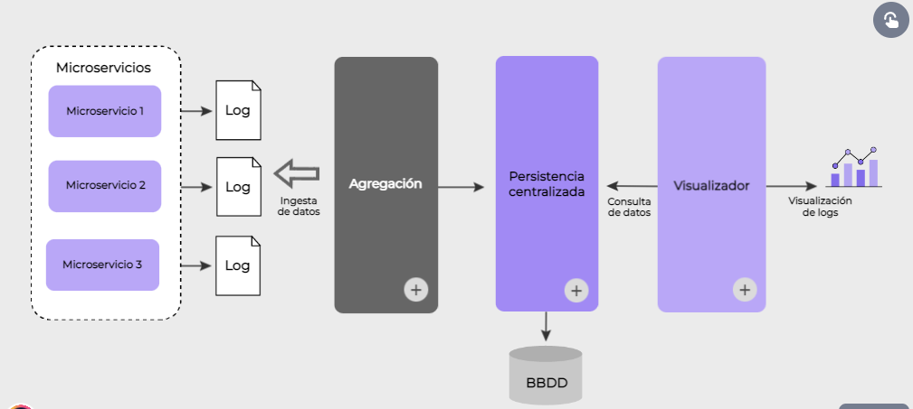
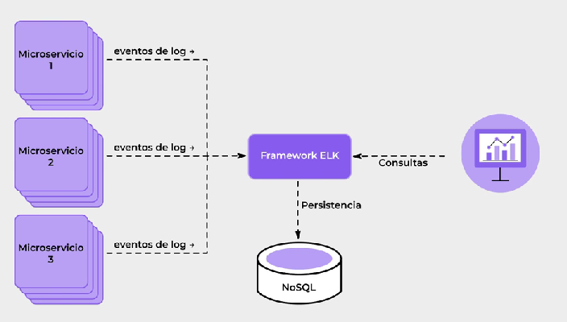
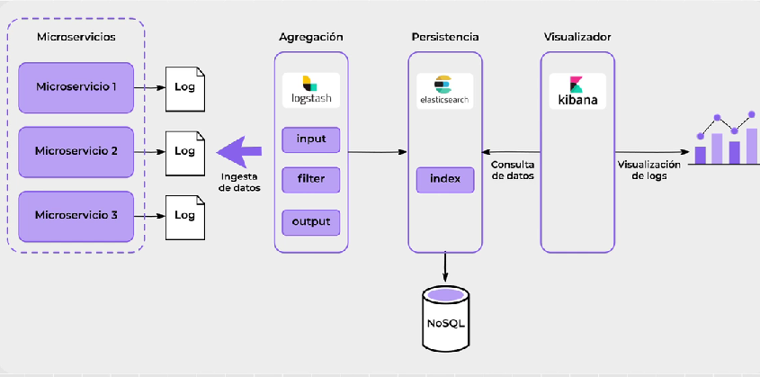
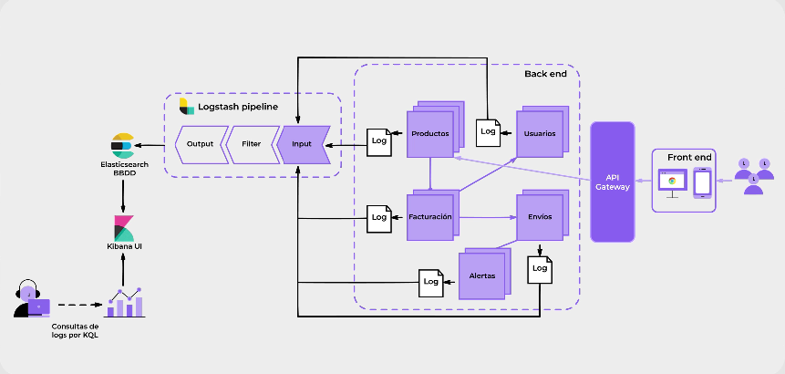
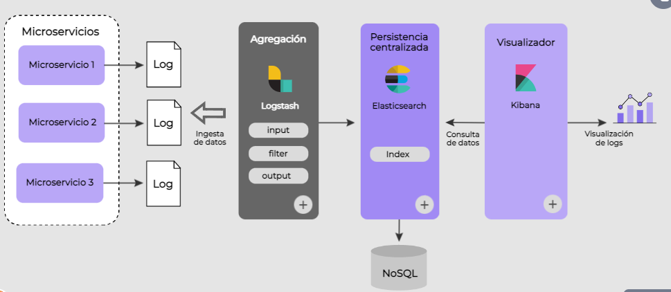
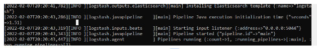
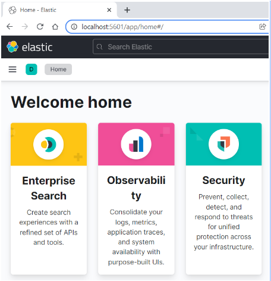
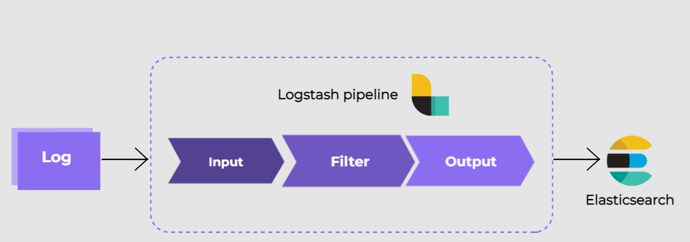

## Patrón Log aggregation
En esta clase aprenderemos sobre el patrón Log aggregation. Este nos permite centralizar la información de los logueos de nuestras aplicaciones para determinar la causa de errores, o bien analizar el comportamiento de nuestra aplicación de forma efectiva, sin necesidad de ir puntualmente a los archivos de log de cada una de las instancias de nuestros microservicios.

Dicho patrón está conformado por tres componentes fundamentales:

- Agregación
- Persistencia centralizada
- Visualizador de logs
- Avancemos para conocerlos en detalle.



**Agregación**: cada microservicio en el diagrama de arquitectura genera sus archivos de logs. Estos archivos son absorbidos por el componente de agregación, quien analiza los logs, los transforma y los envía al componente de persistencia.

**Persistencia Centralizada:** Este componente tomará el input recibido y lo almacenará en un repositorio de información (base de datos) centralizada.

**Visualizador:** Por último, desde elcomponente de visualización, se pueden navegar y analizar los logs de nuestras aplicaciones para determinar un patrón de negocio, como las API más invocadas de nuestra solución, o bien determinar la causa de un error dado.

___ 

## Implementación del Log Aggregation a través del patrón ELK = ElasticSearch + LogStash + Kibana

El framework de ELK implementa el patrón de LOGAGGREGATION facilitando la trazabilidad de errores e infomración de nuestro sistema porque centraliza todos los eventos que se loguean en un único punto. Estos eventos pueden ser consultados x queries y consultas dwesde una app web accediendo a un repo de datos.


El primer paso consiste en la agregación que se realiza por medio del LogStash implementando un pipeline de transformación de origen de datos tomando los archivos e imputs de logs realizando filtros sobre los datos y dejando el output, como segundo paso, para persistir todo en una base de datos NoSQL materializada por ElasticSearch.
En el tercer y último paso, los datos de logs serán visualizados desde una herramienta llamada KIBANA realizando consultas sobre los índices generados el **ElasticSearch**.
.

En una arquitectura de microservicios, cada microservicio tendrá su propio log, en su ubicación específica, con lo que si hay un error, no es escalable buscar uno por uno. Log aggregation permite centralizar estos logs e indexarlos para facilitar la búsqueda. Crece la facilidad de análisis y agiliza la detección de errores minimizando el impacto.

 

### Stack ELK

A partir de lo visto anteriormente, vamos a aprender un nuevo concepto: **ELK**. Se trata de un stack de tecnologías (**Elasticsearch**, **Logstash** y **Kibana**) para ser utilizado en la gestión de agregación de logs implementando una solución para cada uno de los componentes que vimos en la arquitectura genérica.



### Agregación:
para la agregación encontramos a **LOGSTASH** ue es un pipeline que toma la información de **ininput**, en este caso, los logs de nuestra aplicación, los transforma de acuerdo al criterio de filtro y luego envía esa información a ser persistida en **ELASTICSEARCH**.

### Persistencia centralizada
ELASTICSEARCH es el componente de persistencia. Está basado en LUcene (framework de persistencia de información utilizando índices, que optimiza a gran escala la búsqueda y guardado de información).

### Visualizador (Kibana)
Por último, KIBANA es la herramienta del stack de ELK que se ecarga de explotar la información persistida en los índices de Elasticsearch, accediendo a sus datos mediante una interfaz de usuario por páginas web.

## Instalaciones del stack ELK

Antes de comenzar a desarrollar un ejemplo práctico, debemos descargar los tres frameworks que componen a la solución de ELK. A continuación te contamos cómo hacerlo.

Como mencionamos anteriormente, los tres frameworks que componen a la solución ELK son Logstash, Elasticsearch y Kibana. Veamos cómo instalarlos.

### Instalación de Logstash
- Descargar el binario de la página oficinal y ejecutar el archivo BAT o SH, según nuestro sistema operativo: https://www.elastic.co/downloads/logstash.

- Descomprimir el archivo ZIP.
- Ejecutar el siguiente comando dentro de la carpeta bin:
**logstash -f ../config/logstash-sample.conf**
Luego, se podrá observar este mensaje dentro de la consola de ejecución:


### Instalación de Elasticsearch
1. Descargar el binario de la página oficinal y ejecutar el archivo BAT o SH, según nuestro sistema operativo: https://www.elastic.co/es/downloads/elasticsearch.

2. Descomprimir el archivo ZIP.
3. Ejecutar el siguiente comando dentro de la carpeta bin: elasticsearch.
4. Luego, en el navegador, validar el correcto start-up llamando a la URL http://localhost:9200.


### Instalación de Kibana
1. Descargar el binario de la página oficinal y ejecutar el archivo BAT o SH, según nuestro sistema operativo: https://www.elastic.co/es/downloads/kibana.
2. Descomprimir el archivo ZIP.
3. Modificar, dentro de la carpeta config, el archivo kibana.yml indicando cuál es el origen de datos de nuestro visualizador:
elasticsearch.hosts: ["http://localhost:9200"]
4. Ejecutar el siguiente comando dentro de la carpeta bin: kibana.
5. Luego, en el navegador, validar el correcto start-up llamando a la URL: http://localhost:5601.



### Implementación del stack ELK
Ahora, a partir de un ejemplo, veremos cómo implementar el stack ELK. 
Vamos a tomar como base un microservicio básico en Spring Boot que haga logging, tanto de información básica como excepciones, en dos URL distintas. Dichos logs deben centralizarse en un servidor de ELK, para lo que tenemos que configurar primero la agregación de estos logs dentro de nuestro Logstash.

Como vimos, Logstash es un pipeline que tiene diferentes acciones para llevar la información desde el punto de partida hasta el destino. Este pipeline se materializa en un archivo de configuración que alimenta a Logstash en su inicialización. Está conformado por el siguiente formato básico donde se indica en cada sector qué hacer en el paso del pipeline:

input{
}

filter{
}

output{
}



### INPUT
El objetivo es leer el archivo de log de nusetra aplicación como punto de entrada. Para eso, agregamos las siguientes líneas en el sector de input:

```java
input{
    file{
        type => "java"
        path => "C:/log/dh-spring-elk.log"
        codec => multiline {
            pattern => "^%{YEAR}-%{MONTHNUM}-%{MONTHDAY} %{TIME}.*"
            negate => "true"
            what => "previous 
        }
    }
}
```
<span style="color:violet"> input: </span> el input será un file

<span style="color:violet">type: </span> el path es la ruta donde tenemos nuestro archivo LOG

<span style="color:violet">codec:</span> indica la lógica que deben tener los mensajes que se leen para asociarlos a un mismo evento. Indicamos si unmensaje está asociado o no a un patrón de mensaje para tomarlo o no como un único evento y agregarlo delante o detrás del mensaje original.
Dentro del codec, tenemos distintos parámetros que serán las instrucciones par procesar ese input. En este caso, multiline, pattern, negate y what.

<span style="color:violet"> multiline: </span>indica que podemos recibir múltiples líneas como entrada.
<span style="color:violet"> pattern: </span>: es la regex tal que si la entrada coincide con esta regex, ese input debe considerarse como un evento y evantualmente ser pocesado.
<span style="color:violet"> negate: </span> Indica si la expresión de pattern debe ser negaa para considerar un input como evento a logear. Por default es falso

<span style="color:violet">what: </span> indica si el match encontrado debe asociarse al evento anterior o al siguiente (por lo general, es el anterior). Por ejemplo, se interrumpe el acceso a la base de datos y el sistema se loguea a una excepción, luego de la caída. Sin embargo, suponemos que logeamos un pico de transacciones, la base sigue online, pero se va a caer en los próximos minutos, en ese caso, podríamos asociar un patrón al evento sigueinte.

## configuación del Filter
supongamos que queremos filtrar por queries los mensajes relacionados con una excepción. Para eso, podemos agregar tags para facilitar esta tarea de búsqueda desde Kibana.
 
```java
filter {
    #si la línea de log tiene la palabra "at" luego de un tab, quiere decir que es una excepción.
    if [message] =~"\tat"{
        grok {
            match => ["message", "^(\tat)"]
            add_tag => ["stacktrace"]
        }
    }
```

## Output
Por último, tenemos que asociar la salida de Logstash al Elasticsearch que hemos inicializado para poder persistir la información.


```java
output{
    elasticsearch{
        hosts => ["localhost:9200"]
    }
    stdout{
        codec => rubydebug
    }
}
```


